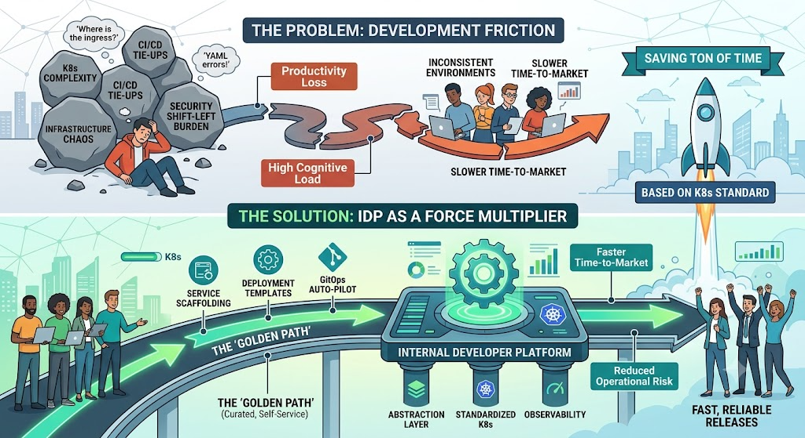

Every platform engineering team eventually hits the same wall: developers are
waiting on platform for resources, secrets, and environment status — not because
platform is slow, but because the information gap is real. W'xOps was built to
close that gap without building a new control system on top of the one that already works.

{/* truncate */}

## Why We Built It

Every platform engineering team eventually arrives at the same crossroads.

The business is growing. Teams are multiplying. Services are proliferating. And somewhere in the middle, a platform team is fielding the same requests it fielded last quarter: "Can you provision a database for us?" "Which secret prefix does staging use?" "Why didn't my image update?" "Who promoted this to production and when?"

The instinct is to automate. Write a script. Build an internal tool. Create a Slack bot. Each of these solves one ticket — and adds one more thing to maintain.

W'xOps was built from a different instinct: **the problem is not that platform teams need more automation. The problem is that developers are making decisions without the context they need to make them well.**

When a developer doesn't know which namespace their staging service runs in, they ask platform. When a developer doesn't know what lifecycle state their component is in, they ask platform. When a developer can't find the GitOps PR that promoted their service, they ask platform. The platform team isn't a bottleneck — it's an information gap.

W'xOps is an answer to the information gap, not a replacement for the platform team.

## The Decision That Matters

Before writing a single line of code, there is a prior question: what should an Internal Developer Portal actually do?

There are two answers to this question, and they lead to very different architectures.

**Answer one:** the portal is a control plane. It manages resources directly. It provisions databases, creates namespaces, rotates secrets, scales pods. Developers interact with the portal, the portal interacts with the infrastructure. The platform team configures the portal; the portal does the rest.

**Answer two:** the portal is a visibility layer. It surfaces the state of resources that already exist in the system. Developers see what's happening, understand what they own, and can initiate changes through the right channels. The infrastructure manages itself; the portal makes that self-management legible.

W'xOps chose answer two — deliberately, unconditionally, and with full awareness of what that choice costs.

The cost is real. A visibility layer cannot hide infrastructure from developers entirely. A developer using W'xOps will eventually encounter Kubernetes concepts, GitOps vocabulary, and OIDC authentication flows. The portal reduces the surface area — it derives namespaces from Pinniped groups, generates overlay manifests instead of asking developers to write YAML, and presents ArgoCD sync status in plain language. But it does not abstract away the system. The system is still there.

The reward is also real. A visibility layer cannot drift from the system it describes. W'xOps reads from Kubernetes — it does not write to it. State lives in Git, in the Crossplane XRs, in the Vault KV store. The portal displays that state. If the portal goes down, the infrastructure continues. If the portal is wrong, you can verify against the source of truth. There is no portal database to back up, no portal permission system to audit, no portal cache to invalidate when reality changes.

This is the architectural bet at the heart of W'xOps: **legibility over control**.

## Why Crossplane and Not Just GitOps

The platform engineering community has largely settled on GitOps as the right model for infrastructure management. Apply a YAML file to a Git repository; a controller reconciles the cluster to match. Repeatability, auditability, rollback — all are built in.

W'xOps uses GitOps. Every tenant overlay lives in `gitops-infra`. Every promotion goes through a PR. ArgoCD syncs the state.

But GitOps alone has a proximity problem.

When a developer writes a `Deployment` manifest, they are writing at the level of the Kubernetes API. They know what containers to run, what ports to expose, what environment variables to inject. But they do not know — and should not need to know — which CNPG cluster has spare capacity for their database, which `ClusterIssuer` to use for their TLS certificate, or how the Vault ExternalSecret should be wired to match the platform's secret path convention.

Crossplane solves this with Composite Resource Definitions. A developer declares an `XTenantApp` — name, image, whether they need a database, what resources the pod needs. The Crossplane composition generates the Deployment, the Service, the IngressRoute, the TLS Certificate, the ExternalSecret, and the Darlane debug twin. The developer's intent is captured at the right level of abstraction; the platform's conventions are encoded in the composition.

W'xOps sits one layer above this. The scaffold wizard collects what the developer knows — service name, team, language, whether they need a database — and generates the `XTenantApp` base manifest and the dev overlay. ArgoCD picks it up. Crossplane expands it. A running service appears.

The chain is: **developer intent → portal scaffold → Crossplane XR → composed Kubernetes resources → running workload**.

Each step in this chain is explicit, auditable, and recoverable. The portal does not hide any part of it from the platform team.

## The AI-Era Argument

There is a reason to build this in 2026 that would not have been obvious five years ago — and the reason is what happened in 2025.

In 2025, code generation crossed a threshold. A senior engineer who once spent a week scaffolding a new service from scratch could produce a working skeleton in an afternoon. Not a toy — a real skeleton with a Dockerfile, a CI pipeline, health endpoints, and structured logging. The frameworks already existed. The libraries were already documented. What AI changed was the cost of assembling them.

By 2026, teams were living with the consequences.

Not the consequences most people predicted — the security risks, the legal questions, the model reliability debates. Those were real, but they were manageable. The consequence that turned out to be harder was simpler: **there were more services than anyone could keep track of.**

When a developer can generate ten services in the time it used to take to generate one, the platform team's problem is not helping them write code. It is helping them understand what they already own. Which services are in production. Which share a database that three other teams depend on. Which were scaffolded six months ago with a template that has since been deprecated. Which have a health endpoint that stopped responding last Tuesday.

This is the catalog problem. And the catalog problem does not get easier as services proliferate — it compounds.

W'xOps was not built in anticipation of this. It was built in response to it — in 2026, after 2025 had already proved the problem was real. That distinction matters. W'xOps is not a bet on a trend. It is an answer to something teams were already experiencing when we started writing it.

The service catalog is not a convenience feature. It is the mechanism by which a small platform team maintains legibility over a system growing faster than any individual can track manually. The golden-path scaffold is not a code generator — it is a contract. Every service that enters the platform through this path has known properties: a health endpoint, a graceful shutdown handler, a CI pipeline that produces images with predictable tag formats, a Darlane debug twin for inner-loop development. Those properties are enforced at scaffolding time and visible in the catalog forever after.

2025 proved that code is cheap. W'xOps is built for what comes after that — the harder problems of context, reproducibility, and scale.

## What W'xOps Is Not

Understanding what W'xOps does not do is as important as understanding what it does.

W'xOps is not a Kubernetes managed service. It does not provision clusters, manage node pools, or handle cloud provider billing.

W'xOps is not a CI/CD platform. It reads from the CI pipeline — ArgoCD sync status, image tags, build timestamps. It does not replace your pipeline.

W'xOps is not a secrets manager. It can create and update Vault entries, guided by strict rules about what must exist before it writes. It cannot read secrets. It cannot delete them.

W'xOps is not an approval gate. Lifecycle promotion from experimental to production is gated by role — platform team or team managers only. But W'xOps does not make that decision. The human who clicks the promotion panel makes that decision. W'xOps enforces that only the right humans can trigger it.

W'xOps is not a replacement for platform engineers. It is a tool for platform engineers to give developers appropriate visibility and appropriate self-service capability — without expanding the blast radius of developer actions beyond what is safe.

## The Philosophy

There is a single sentence that captures what W'xOps is trying to be:

> **W'xOps supports. The decision is yours. The infrastructure is yours. The platform is yours.**

This is not humility. It is an architectural commitment.

When a developer uses the scaffold wizard, they are making decisions: which team owns this service, what runtime it uses, whether it needs a database. W'xOps records those decisions, generates the appropriate manifests, and creates the PR. But the developer reviews the PR. The developer merges it. The developer owns what gets created.

When a team promotes a service to staging, they are making a decision: this code is ready for a pre-production environment. W'xOps provides the promotion panel, checks the role gate, creates the overlay PR. But the team manager clicks the button. The team manager is accountable for that decision.

When a platform team installs W'xOps on their cluster, they are making decisions about their golden path: which templates to offer, which Crossplane compositions to deploy, which policies to enforce. W'xOps provides the mechanism. The platform team owns the model.

This matters because the alternative — a portal that makes decisions for you — creates two kinds of problems. First, it hides the system from the people who need to understand it. When the system breaks, and systems break, the person debugging it needs to know what the portal decided and why. A portal that decides opaquely is a portal that is impossible to debug. Second, it creates a false sense of control. A portal that writes directly to Kubernetes looks powerful right up until the moment it gets compromised, misconfigured, or simply wrong about what the cluster needs. W'xOps's structural read-only constraint is not a limitation — it is a guarantee that the portal can never be the source of a production incident.

## The Ambition

:::warning[Approach the IDP on the wrong ways]
Following these articles

- [HackerNoon - Internal Developer Platforms Are Booming, But Adoption Is Failing
](https://hackernoon.com/internal-developer-platforms-are-booming-but-adoption-is-failing)
- [Rack2Cloud - IDPs Don’t Solve the Ownership Problem. They Defer It.](https://www.rack2cloud.com/internal-developer-platform-ownership/)

There are many reasons why lead the IDP to become for failure instead tackle and reduce the bottleneck or dependency on DevOps Or infrastructure Engineer
- IDP spent only for builder and not for user (DevEx)
- Platform grown in the terminal, not just the portal
- And many more reason but depend on the demand of your organization about Managment, Cost, ...
:::

IDP need feedbacks and create the developer loop to concreate the succeess of adopters. W'xOps IDP want to prevent these problems, and try to deal with them for open than lock them for stricted structure.

The ambition of W'xOps is not to become the most feature-complete Internal Developer Portal available. There are already feature-complete platforms. They require dedicated teams to operate, plugin ecosystems to maintain, databases to back up, permission systems to audit, and version matrices to reconcile.

The ambition of W'xOps is to be the platform that a small, excellent platform team can run without a dedicated ops rotation — because it has no moving parts beyond the cluster itself.

One binary. One container. Zero databases. Every change in Git. Every permission in RBAC. Every secret in Vault.

If that platform team is disciplined about their golden path, consistent about their XR schema, and careful about their Kyverno policies, they can hand off a self-service platform to developer teams and spend their own time on the things that actually require platform expertise: capacity planning, security posture, observability, onboarding new capabilities.

That is the picture: one platform team that is genuinely a force multiplier, not a ticket queue. Developers who can provision, debug, and promote without filing a request. A catalog that accurately reflects what exists in the cluster because the catalog and the cluster are derived from the same Git source of truth.

This is achievable. It requires discipline, not complexity. W'xOps is designed to support that discipline — not to impose it, and not to replace it.

The infrastructure is yours to build. The decisions are yours to make. W'xOps is here to make sure you can see what you've built and understand what you're deciding.

:::info
Choosing to follow IDP and Golden Path in 2026, with these decisions will change whole of stories for developing, applied new technologies, but also encounter lots of trouble for maintain, time for development and set the right line for your production with platform still be a biggest the question ever, so that can be several oppourtunities, but also that can be pitfall for any team follow
without any preparation, so I genuinely to say that fair enough for choose 1 of IDP on the market for adoption. 

But if you want to try W'xOps IDP for different experience, please contact with me via email `contact@wxops.cloud` or submit the form at [W'xOps Enterprise](https://www.wxops.cloud/enterprise/) for more information.
:::