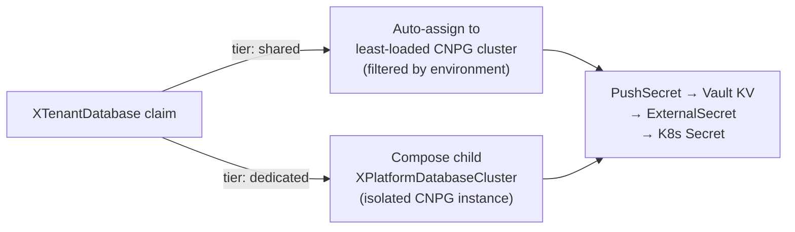

# Kubernetes APIs (wxops-core)

`wxops-core` is a set of **Crossplane Configuration packages** distributed as OCI
images. Each package ships an XRD (schema) and a Composition (implementation).
Tenant developers and the portal create XR claims; Crossplane expands them into
real Kubernetes resources on the spoke cluster.

## API Groups

| Group | Purpose |
|---|---|
| `platform.wxops.cloud` | Tenant workloads, databases, and platform cluster management |
| `gitea.wxops.cloud` | Gitea organisation, team, user, and repository provisioning |

## Package Catalog

| Package | Kind | API Group/Version | What it provisions |
|---|---|---|---|
| `tenant-app` | `XTenantApp` | `platform.wxops.cloud/v1alpha1` | Deployment, Service, IngressRoute, optional Darlane twin, optional Certificate |
| `tenant-database` | `XTenantDatabase` | `platform.wxops.cloud/v1alpha1` | PostgreSQL database on a shared or dedicated CNPG cluster; Vault credentials |
| `platform-database-clusters` | `XPlatformDatabaseCluster` | `platform.wxops.cloud/v1alpha1` | A CloudNativePG cluster (composed by `XTenantDatabase tier:dedicated`) |
| `gitea-repository` | `XGiteaRepository` | `platform.wxops.cloud/v1alpha1` | Gitea repository inside an organisation |
| `gitea-org` | `XGiteaOrg` | `platform.wxops.cloud/v1alpha1` | Gitea organisation |
| `gitea-team` | `XGiteaTeam` | `platform.wxops.cloud/v1alpha1` | Team within a Gitea org |
| `gitea-user` | `XGiteaUser` | `platform.wxops.cloud/v1alpha1` | Gitea user account |

## XTenantApp — What It Composes

A single `XTenantApp` claim expands into:

| Composed resource | Always | When |
|---|---|---|
| `Deployment` | ✓ | — |
| `Service` | ✓ (when `service.enabled`) | — |
| `IngressRoute` (Traefik) | — | `ingress.enabled: true` |
| `TraefikService` (weighted split) | — | `darlane.trafficWeight > 0` |
| `Certificate` (cert-manager) | — | `ingress.tls.clusterIssuer` set |
| `ServiceAccount` | — | `serviceAccount.create: true` |
| `PersistentVolumeClaim` | — | `volumes[].create: true` |
| Darlane `Deployment` (`<app>-darlane`) | — | `darlane.enabled: true` |

→ Full field reference: [XTenantApp](./xtenant-app)

## XTenantDatabase — Shared vs Dedicated



`tier: shared` selects the least-loaded `XPlatformDatabaseCluster` marked
`shared: true` whose `environment` matches the claim's environment — dev
databases only land on dev clusters. `tier: dedicated` composes a child
`XPlatformDatabaseCluster` for full isolation.

→ Full field reference: [XTenantDatabase](./xtenant-database)
→ Platform cluster reference and multi-modal PostgreSQL vision: [XPlatformDatabaseCluster](./xplatform-database-cluster)

## Gitea Provisioning APIs

The four Gitea packages (`XGiteaOrg`, `XGiteaTeam`, `XGiteaUser`,
`XGiteaRepository`) provision Gitea resources via the Gitea REST API. They are
used by the portal scaffold flow to create repositories and ensure the tenant
organisation structure exists.

→ Full field reference: [Gitea Resources](./gitea-resources)

## OCI Distribution and Installation

All packages follow the **Upbound/Crossplane Configuration package** model:
each package is built as an OCI image and pushed to the Gitea container registry.
Crossplane installs them by pulling the OCI image and applying the embedded XRDs
and Compositions.

```yaml
# Applied by platform/crossplane/composition-app.yaml in wxops-gitops-infrastructure
# (ArgoCD Application, wave 2 — platform-configs plane)
apiVersion: pkg.crossplane.io/v1
kind: Configuration
metadata:
  name: wxops-tenant-app
spec:
  package: gitea.example.com/platform-team/wxops-core/tenant-app:v0.2.4
  packagePullPolicy: IfNotPresent
  packagePullSecrets:
    - name: gitea-registry-credentials
```

One `Configuration` CR per package. Upgrading means updating the `package` tag
and merging a PR to `wxops-gitops-infrastructure` — ArgoCD applies it at wave 2
on the next sync. No `helm upgrade`, no `kubectl apply`, no cluster access
required by the platform team.
