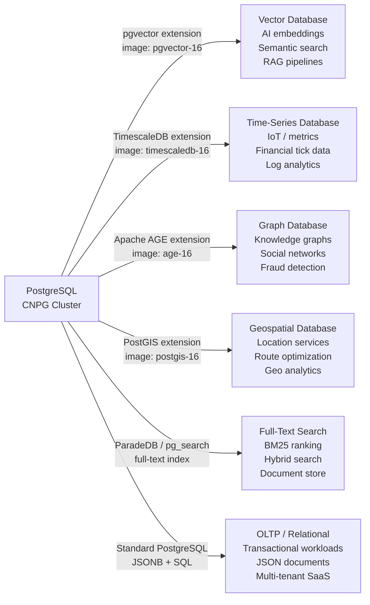

# XPlatformDatabaseCluster

Platform-managed [CloudNativePG](https://cloudnative-pg.io/) cluster with PgBouncer
pooling, Vault credential seeding, Prometheus monitoring, Barman backups, and
shared-pool labeling for dynamic tenant assignment.

| | |
|---|---|
| **Group** | `platform.wxops.cloud` |
| **Kind** | `XPlatformDatabaseCluster` |
| **Plural** | `xplatformdatabaseclusters` |
| **Scope** | `Cluster` |
| **API version** | `v1alpha1` (served, storage) |
| **Composition function** | `function-kcl` |

:::info[This is a platform resource]
`XPlatformDatabaseCluster` is managed by the **platform team**, not tenant developers.
Tenants create databases through [XTenantDatabase](./xtenant-database), which
auto-assigns to a shared pool cluster or composes a child `XPlatformDatabaseCluster`
as a dedicated resource. Platform engineers provision and tune the clusters; tenants
only see the Vault-backed connection credentials.
:::


## PostgreSQL as a Multi-Modal Database Platform

The ambition behind `XPlatformDatabaseCluster` is more than hosting a standard
relational database. PostgreSQL has a mature extension ecosystem that transforms a
single database engine into a specialist system for different workload types — without
running separate infrastructure for each.

A single `XPlatformDatabaseCluster` definition, combined with the right extension
image and `postgresConfig`, becomes a purpose-built database for any of these profiles:



### Extension profiles

| Profile | Extension | Image | `appFlavor` hint | What it enables |
|---|---|---|---|---|
| **Vector search** | `pgvector` | `pgvector/pgvector:pg16` | `ai`, `ai-webapp` | Embedding similarity (`<=>`, `<#>`, `<->`), HNSW + IVFFlat indexes, RAG pipelines, semantic search |
| **Time-series** | `timescaledb` | `timescale/timescaledb:2.x-pg16` | — | Automatic time partitioning, continuous aggregates, compression, `time_bucket()` queries |
| **Graph** | `age` (Apache AGE) | custom `age-pg16` | — | openCypher queries (`SELECT * FROM ag_catalog.cypher(...)`), graph traversals, property graphs |
| **Geospatial** | `postgis` | `postgis/postgis:16-3.4` | `geo-webapp` | Geometry types, spatial indexes (GIST), geographic functions, `ST_Distance`, `ST_Within`, map tiles |
| **Full-text / hybrid search** | `pg_search` (ParadeDB) | `paradedb/paradedb:pg16` | `search-webapp` | BM25 ranking, hybrid BM25+vector, `@@@` operator, columnar analytics |
| **Standard OLTP** | built-in | `ghcr.io/cloudnative-pg/postgresql:16` | `webapp` | JSONB, full SQL, `pg_trgm`, `uuid-ossp`, partitioning, row-level security |

### Why PostgreSQL extensions over separate systems

Running a dedicated vector database, a separate time-series system, and a standalone
graph engine multiplies operational complexity — three different backup models, three
credential systems, three sets of observability exporters. Each new system requires the
platform team to build and maintain integration.

PostgreSQL extensions ship as a single CNPG cluster. The platform team builds or pulls
an extension image once; `XPlatformDatabaseCluster` wraps it with the same pooling,
backup, monitoring, and Vault credential seeding used for every other cluster. Tenants
enable extensions per-database via `XTenantDatabase.spec.parameters.extensions[]`.

### Enabling extensions

Extensions are activated at two levels:

1. **Cluster image** — the PostgreSQL image must have the extension shared library
   compiled in. Standard CNPG community images (`ghcr.io/cloudnative-pg/postgresql:16`)
   do not include extension libraries. Build or pull a custom image with the
   extension pre-installed.

2. **Database level** — `XTenantDatabase` enables extensions inside a specific database
   via `spec.parameters.extensions[]`. The extension library must already be in the
   cluster image or installed separately.

The `appFlavor` label on `XTenantApp` (`ai`, `geo-webapp`, `search-webapp`) is the
signal the platform team or scaffold wizard reads to select the right
`XPlatformDatabaseCluster` and extensions when provisioning a tenant database.

:::tip[Custom image for extension clusters]
CNPG supports specifying a custom image per cluster. When provisioning a vector
or PostGIS cluster, the platform team uses a pre-built image and points the cluster at it.
A separate `XPlatformDatabaseCluster` per extension profile keeps standard and
specialist workloads isolated — shared pools mix tenants, not extension types.
:::


## `spec.parameters`

:::note[Vault path convention]
All `PushSecret`/`ExternalSecret` paths in this package omit the `platform/`
prefix (e.g. `database-clusters/...`, not `platform/database-clusters/...`).
The `vault-platform` `ClusterSecretStore` is itself scoped to the `platform/`
KV2 path — adding `platform/` again would write to `platform/platform/...`.
:::

### Core

| Field | Type | Required | Default | Description |
|---|---|---|---|---|
| `cluster` | `string` | | `"default"` | `provider-kubernetes` `ProviderConfig` to compose resources through. `default` (the hub cluster) is the only one wired up today — leaving this unset is behavior-neutral. Multi-cluster targeting is not yet functional; no spoke `ProviderConfig` exists yet. |
| `clusterName` | `string` | yes | | CNPG cluster name. Tenants pass this as `clusterRef` in `XTenantDatabase` to target this cluster explicitly. |
| `namespace` | `string` | yes | | Kubernetes namespace where the CNPG cluster is created. |
| `instances` | `integer` (1–9) | | `1` | PostgreSQL instances. `1` = standalone (dev/test), `3` = HA with automatic failover. |
| `postgresVersion` | `integer` | | `16` | PostgreSQL major version. Maps to `ghcr.io/cloudnative-pg/postgresql:{version}` for standard clusters; override the image at the CNPG level for extension profiles. |
| `storageSize` | `string` | | `"8Gi"` | PVC storage per instance. Size according to expected data volume, not just initial data. |
| `shared` | `boolean` | | `false` | Mark as available for the shared multi-tenant pool. When `true`, `XTenantDatabase` with `tier: shared` can auto-assign to this cluster. The XR manifest must also have `wxops.cloud/managed-by: platform-database-clusters` label. |
| `environment` | `string` | | `"dev"` | One of `dev`, `staging`, `prod`. When `shared: true`, `XTenantDatabase` only assigns databases whose `environment` matches — dev databases land on dev clusters, prod on prod. |
| `vaultPlatformSecretStore` | `string` | | `"vault-platform"` | ESO `ClusterSecretStore` used to mirror CNPG's superuser and app secrets to Vault at `database-clusters/{clusterName}/superuser-creds` and `database-clusters/{clusterName}/app-creds`. When `enablePooler` is true, pooler connection strings are merged into both entries. |

### Pooler (RW)

| Field | Type | Default | Description |
|---|---|---|---|
| `enablePooler` | `boolean` | `true` | Deploy a PgBouncer `Pooler` (type `rw`) alongside the cluster. Connection strings with pooler endpoints are included in the Vault entries. |
| `poolMode` | `string` | `"transaction"` | PgBouncer pool mode: `transaction` (recommended for stateless apps) or `session` (required for apps that use advisory locks or `SET LOCAL`). |

### `readReplica`

Dedicated read-only pooler for replica traffic. Useful for reporting or analytics
queries that should not compete with OLTP write traffic.

| Field | Type | Default | Description |
|---|---|---|---|
| `readReplica.enablePooler` | `boolean` | `false` | Deploy a second PgBouncer `Pooler` of type `ro`. Exposes `{clusterName}-ro-pooler` Service. |
| `readReplica.poolerInstances` | `integer` (1–9) | `1` | |

### `postgresConfig`

PostgreSQL server configuration (`postgresql.conf`) and client auth (`pg_hba.conf`).
Some parameters are owned by CNPG and cannot be overridden (`archive_command`,
`listen_addresses`, `wal_level`, `port`, `data_directory`).

#### `postgresConfig.tuning`

Common sizing/tuning knobs. These are translated into `postgresql.conf` parameters.

| Field | Type | Default | Description |
|---|---|---|---|
| `tuning.maxConnections` | `integer` | `200` | Max client connections. With PgBouncer, keep this low (100–300); without pooler, raise it. |
| `tuning.sharedBuffers` | `string` | | e.g. `"256MB"`, `"1GB"`. Rule of thumb: 25% of RAM. |
| `tuning.workMem` | `string` | | e.g. `"16MB"`. Per sort/hash operation. High concurrency × high `workMem` = OOM risk. |
| `tuning.maintenanceWorkMem` | `string` | | e.g. `"256MB"`. Used by VACUUM, CREATE INDEX, ALTER TABLE. |
| `tuning.effectiveCacheSize` | `string` | | e.g. `"3GB"`. Hint to the planner: estimate of OS + Postgres caches combined. |
| `tuning.maxWalSize` | `string` | | e.g. `"2GB"`. Max WAL size before a checkpoint is forced. |
| `tuning.minWalSize` | `string` | | e.g. `"512MB"`. |
| `tuning.checkpointCompletionTarget` | `string` | | Float as string, e.g. `"0.9"`. Spreads checkpoint writes over 90% of the checkpoint interval to reduce I/O spikes. |
| `tuning.randomPageCost` | `string` | | Float as string. Use `"1.1"` for SSD-backed PVCs (default planner assumption is `"4"` for spinning disks). |
| `tuning.logMinDurationStatement` | `string` | | Milliseconds, or `"-1"` to disable. e.g. `"1000"` logs queries slower than 1s. |
| `tuning.logStatement` | `string` | | One of `none`, `ddl`, `mod`, `all`. |
| `tuning.statementTimeout` | `string` | | e.g. `"30s"`, `"5min"`. Hard query kill after this duration. |
| `tuning.idleInTransactionSessionTimeout` | `string` | | e.g. `"10min"`. Kills sessions stuck in idle-in-transaction. |

#### `postgresConfig.extraParameters`

Free-form `postgresql.conf` key-value pairs for parameters not covered by `tuning`.
Keys here override the same key in `tuning`.

```yaml
postgresConfig:
  extraParameters:
    track_io_timing: "on"          # required for pg_stat_io visibility
    wal_compression: "zstd"        # reduces WAL volume ~3-5x
    huge_pages: "try"              # use huge pages if available
    max_parallel_workers_per_gather: "4"  # vector index scans benefit from parallelism
```

#### `postgresConfig.pgHba`

Additional `pg_hba.conf` rules, appended after CNPG's own required rules.

```yaml
postgresConfig:
  pgHba:
    - "hostssl app all 10.0.0.0/8 scram-sha-256"
```

### `monitoring`

| Field | Type | Default | Description |
|---|---|---|---|
| `monitoring.enablePodMonitor` | `boolean` | `false` | CNPG creates a `PodMonitor` so Prometheus Operator scrapes the cluster metrics exporter on port 9187. Requires Prometheus Operator CRDs in-cluster. |

### `backup`

Barman object-store WAL archiving and scheduled base backups.

| Field | Type | Default | Description |
|---|---|---|---|
| `backup.enabled` | `boolean` | `false` | Activates WAL archiving and creates a `ScheduledBackup` CR. |
| `backup.destinationPath` | `string` | | Object store path. S3/MinIO: `s3://my-bucket/cnpg/cluster-a`; GCS: `gs://my-bucket/cnpg/cluster-a`. |
| `backup.endpointURL` | `string` | | Override the storage endpoint for MinIO, Ceph RGW, etc. Leave blank for AWS S3, GCS, or Azure Blob. |
| `backup.credentialsSecretRef.name` | `string` | | Secret with storage credentials. S3/MinIO: `ACCESS_KEY_ID` + `ACCESS_SECRET_KEY`. GCS: `APPLICATION_CREDENTIALS` (service-account JSON). Azure: `AZURE_STORAGE_ACCOUNT` + `AZURE_STORAGE_KEY`. |
| `backup.credentialsSecretRef.namespace` | `string` | | |
| `backup.schedule` | `string` | `"0 0 2 * * *"` | 6-field cron (sec min hr dom mon dow). Default: daily at 02:00 UTC. |
| `backup.retentionPolicy` | `string` | `"30d"` | Barman retention window for WAL and base backups (e.g. `7d`, `30d`, `90d`). |

### `managedRoles[]`

Cluster-wide PostgreSQL roles managed declaratively — platform team owns this array
(no SSA coordination with `tenant-database`). Each role gets an ESO password generator,
a stable `ExternalSecret` (`refreshInterval: "0"` — not auto-rotated), and a `PushSecret`
to Vault at `database-clusters/{clusterName}/roles/{name}/creds`.

To change a managed role's password: delete the `{clusterName}-{name}-creds` Secret.
CNPG regenerates it and runs `ALTER ROLE` with the new value.

| Field | Type | Default | Description |
|---|---|---|---|
| `managedRoles[].name` | `string` (required) | | PostgreSQL role name. |
| `managedRoles[].ensure` | `string` | `"present"` | `present` or `absent`. |
| `managedRoles[].login` | `boolean` | `true` | |
| `managedRoles[].superuser` | `boolean` | `false` | |
| `managedRoles[].createdb` | `boolean` | `false` | |
| `managedRoles[].createrole` | `boolean` | `false` | |
| `managedRoles[].inherit` | `boolean` | `true` | Inherit privileges from `inRoles` memberships. |
| `managedRoles[].replication` | `boolean` | `false` | |
| `managedRoles[].bypassrls` | `boolean` | `false` | Bypass row-level security policies. |
| `managedRoles[].connectionLimit` | `integer` | `-1` | Max concurrent connections. `-1` = unlimited. |
| `managedRoles[].inRoles` | `array<string>` | `[]` | Predefined or custom parent roles (e.g. `pg_read_all_data`, `pg_monitor`). |

### `bootstrapFrom`

How the cluster is initialized. Default (`initdb`) creates a fresh empty cluster.

| Type | Use case |
|---|---|
| `initdb` (default) | Fresh cluster — no existing data to import |
| `import-microservices` | Migrate one database from an external PostgreSQL; roles NOT copied |
| `import-monolith` | Migrate multiple databases and their owners from a legacy shared instance |

Both import types use CNPG's built-in pg_dump-based import. The source PostgreSQL must be
reachable from the cluster during bootstrap. The import is a one-time operation.

| Field | Type | Default | Description |
|---|---|---|---|
| `bootstrapFrom.type` | `string` | `"initdb"` | `initdb`, `import-microservices`, or `import-monolith`. |
| `bootstrapFrom.sourceHost` | `string` | | Source PostgreSQL hostname or IP. |
| `bootstrapFrom.sourcePort` | `integer` | `5432` | |
| `bootstrapFrom.sourceDatabase` | `string` | | Single database to import (`import-microservices` only). |
| `bootstrapFrom.sourceDatabases` | `array<string>` | `[]` | Databases to import (`import-monolith` only). |
| `bootstrapFrom.sourceRoles` | `array<string>` | `[]` | Additional roles to import beyond database owners (`import-monolith` only). |
| `bootstrapFrom.sourceUser` | `string` | `"postgres"` | Source superuser name. |
| `bootstrapFrom.sourceSSLMode` | `string` | `"require"` | One of `disable`, `allow`, `prefer`, `require`, `verify-ca`, `verify-full`. |
| `bootstrapFrom.sourcePasswordSecretRef.name` | `string` | | Secret with key `password` holding the source superuser password. |
| `bootstrapFrom.sourcePasswordSecretRef.namespace` | `string` | | |


## `status`

Read these fields directly rather than polling Crossplane's own composite `Ready`
condition, which is unreliable on this platform's Crossplane v2.3 + function-kcl v0.12.1
combination.

| Field | Type | Description |
|---|---|---|
| `status.clusterName` | `string` | CNPG cluster name, echoed from `spec.parameters.clusterName`. |
| `status.namespace` | `string` | Namespace where the CNPG cluster lives. |
| `status.shared` | `boolean` | Whether this cluster is in the shared multi-tenant pool. |
| `status.environment` | `string` | Environment this cluster serves (`dev`, `staging`, `prod`). |
| `status.created` | `boolean` | True once every composed resource has been observed at least once. Indicates provisioning has started, not that it succeeded. |
| `status.ready` | `boolean` | True when the cluster can actually serve connections: the CNPG `Cluster` is up, and any enabled pooler is up too — tenants are handed the pooler endpoint, not the cluster's directly. Vault credential seeding and scheduled backups are deliberately excluded from this — neither stops a running cluster from serving. |

## Required discovery label

Every `XPlatformDatabaseCluster` that should be available for `XTenantDatabase`
auto-assignment must have this label in its manifest:

```yaml
metadata:
  labels:
    wxops.cloud/managed-by: platform-database-clusters
```

Crossplane's composite reconciler ignores `metadata.labels` — the composition cannot
set discovery labels automatically. Without this label, `XTenantDatabase` with
`tier: shared` will not discover the cluster for pool assignment.


## Examples

### Shared dev cluster (standard OLTP)

```yaml
apiVersion: platform.wxops.cloud/v1alpha1
kind: XPlatformDatabaseCluster
metadata:
  name: shared-dev-pool
  labels:
    wxops.cloud/managed-by: platform-database-clusters
spec:
  parameters:
    clusterName: shared-dev-pool
    namespace: cnpg-system
    instances: 1
    postgresVersion: 16
    storageSize: 50Gi
    shared: true
    environment: dev
    enablePooler: true
    monitoring:
      enablePodMonitor: true
    backup:
      enabled: true
      destinationPath: s3://platform-backups/cnpg/shared-dev-pool
      schedule: "0 0 3 * * *"
      retentionPolicy: "7d"
      credentialsSecretRef:
        name: s3-backup-credentials
        namespace: cnpg-system
```

### Vector cluster (pgvector for AI workloads)

```yaml
apiVersion: platform.wxops.cloud/v1alpha1
kind: XPlatformDatabaseCluster
metadata:
  name: vector-dev
  labels:
    wxops.cloud/managed-by: platform-database-clusters
spec:
  parameters:
    clusterName: vector-dev
    namespace: cnpg-system
    instances: 1
    postgresVersion: 16
    storageSize: 100Gi
    shared: false        # dedicated clusters per vector workload
    environment: dev
    enablePooler: true
    postgresConfig:
      tuning:
        sharedBuffers: "2GB"
        workMem: "64MB"             # vector index scans are memory-intensive
        effectiveCacheSize: "6GB"
        randomPageCost: "1.1"       # SSD-backed PVC
        maintenanceWorkMem: "1GB"   # HNSW index builds use this heavily
      extraParameters:
        max_parallel_workers_per_gather: "4"   # parallel HNSW scans
        track_io_timing: "on"
    monitoring:
      enablePodMonitor: true
```

Tenants then enable `pgvector` when creating a database on this cluster:

```yaml
apiVersion: platform.wxops.cloud/v1alpha1
kind: XTenantDatabase
metadata:
  name: ai-app-embeddings
  labels:
    wxops.cloud/tenant-database: "true"
spec:
  parameters:
    clusterRef: vector-dev
    clusterNamespace: cnpg-system
    dbName: embeddings
    owner: rocket-team
    extensions:
      - vector       # pgvector — similarity search
      - uuid-ossp    # UUID generation for embedding IDs
```

### Time-series cluster (TimescaleDB)

```yaml
apiVersion: platform.wxops.cloud/v1alpha1
kind: XPlatformDatabaseCluster
metadata:
  name: timeseries-prod
  labels:
    wxops.cloud/managed-by: platform-database-clusters
spec:
  parameters:
    clusterName: timeseries-prod
    namespace: cnpg-system
    instances: 3             # HA for production time-series
    storageSize: 500Gi
    shared: false
    environment: prod
    enablePooler: true
    poolMode: session        # TimescaleDB background jobs use session-level state
    postgresConfig:
      tuning:
        sharedBuffers: "4GB"
        workMem: "32MB"
        maxWalSize: "4GB"
        checkpointCompletionTarget: "0.9"
      extraParameters:
        timescaledb.max_background_workers: "8"
    backup:
      enabled: true
      destinationPath: s3://platform-backups/cnpg/timeseries-prod
      retentionPolicy: "90d"
      credentialsSecretRef:
        name: s3-backup-credentials
        namespace: cnpg-system
    monitoring:
      enablePodMonitor: true
    readReplica:
      enablePooler: true
      poolerInstances: 2    # reporting queries go to read replica
```

### Production HA cluster with managed roles

```yaml
apiVersion: platform.wxops.cloud/v1alpha1
kind: XPlatformDatabaseCluster
metadata:
  name: shared-prod-pool
  labels:
    wxops.cloud/managed-by: platform-database-clusters
spec:
  parameters:
    clusterName: shared-prod-pool
    namespace: cnpg-system
    instances: 3
    storageSize: 200Gi
    shared: true
    environment: prod
    enablePooler: true
    poolMode: transaction
    postgresConfig:
      tuning:
        sharedBuffers: "8GB"
        effectiveCacheSize: "24GB"
        workMem: "32MB"
        maxConnections: 200
        statementTimeout: "60s"
        idleInTransactionSessionTimeout: "10min"
        logMinDurationStatement: "500"
    managedRoles:
      - name: readonly
        login: true
        inRoles:
          - pg_read_all_data
      - name: monitor
        login: true
        inRoles:
          - pg_monitor
    monitoring:
      enablePodMonitor: true
    backup:
      enabled: true
      destinationPath: s3://platform-backups/cnpg/shared-prod-pool
      schedule: "0 0 2 * * *"
      retentionPolicy: "30d"
      credentialsSecretRef:
        name: s3-backup-credentials
        namespace: cnpg-system
```


## The Bigger Picture — Inspiration

The multi-modal database vision behind `XPlatformDatabaseCluster` is not a
novel idea — it reflects a growing consensus in the database industry that
PostgreSQL has transcended its relational database origins and become a full
data platform.

Two pieces shaped this direction and are worth reading for anyone on the
platform team who wants to understand *why* the architecture is built this way:

---

**[Postgres is eating the database world](https://medium.com/@fengruohang/postgres-is-eating-the-database-world-157c204dcfc4)**
— Ruohang Feng (creator of [Pigsty](https://pigsty.io/))

The core argument: PostgreSQL has an extension ecosystem of 1,000+ packages
that progressively replaces the need for separate specialized database systems.
Every time an organization adopts InfluxDB for time-series, Pinecone for
vectors, or Neo4j for graphs, they add a new operations burden — a new backup
model, a new credential system, a new monitoring exporter, a new on-call
runbook. PostgreSQL extensions give you the same specialist capability inside
the engine you already operate.

The article maps the specialized database market directly onto the PostgreSQL
extension landscape:

| Specialized system | PostgreSQL equivalent |
|---|---|
| Pinecone, Milvus, Chroma | `pgvector`, `pg_embedding` |
| InfluxDB, Prometheus TSDB | `timescaledb`, `pg_timeseries` |
| Neo4j | Apache AGE, `pgRouting` |
| Elasticsearch, Solr | `pg_search` (ParadeDB), `tsvector` |
| MongoDB | `JSONB` + `jsonschema` |
| Redis (cache/queue) | `PGMQ`, `pg_ivm`, LISTEN/NOTIFY |
| ClickHouse (analytics) | `pg_mooncake`, Citus, `pg_analytics` |

The thesis is not that PostgreSQL is always the right tool — it is that the
**operational cost of running PostgreSQL well is already paid**, and extensions
allow that cost to cover far more workload types than most teams realize.

---

**[Postgres is NOT A DATABASE](https://www.youtube.com/watch?v=b7eXdUOzUTM)**
— YouTube

A talk that reframes how to think about PostgreSQL: not as a relational
database system, but as an **extensible data platform** — a framework for
building specialized data engines. The extension architecture (shared
libraries, custom types, custom operators, custom index AMs, custom FDWs) is
what makes PostgreSQL's breadth possible. Each extension is a first-class
citizen that integrates at the query planner and executor level, not just as
a shim around an external service.

---

### What this means for W'xOps

`XPlatformDatabaseCluster` is the operational layer that makes this philosophy
concrete. When the platform team ships a new PostgreSQL extension image, they
do not introduce a new database system — they add a new cluster profile to an
infrastructure that already has pooling, backups, monitoring, Vault credential
seeding, and ArgoCD lifecycle management fully working.

A tenant's `XTenantDatabase` claim enables vector search, time-series
compression, or graph traversal by specifying `extensions: [vector]` or
`extensions: [timescaledb]`. The infrastructure underneath does not change.
The on-call runbook does not change. The Vault path schema does not change.

This is the compounding advantage: the platform's investment in one well-operated
PostgreSQL stack compounds across every workload type the team adds, rather than
fragmenting into N separate database systems each requiring N separate operator
teams.


## See also

- [XTenantDatabase](./xtenant-database) — how tenants provision databases on platform clusters
- [Crossplane APIs](./crossplane-apis) — package catalog, OCI installation, and shared-pool diagram
