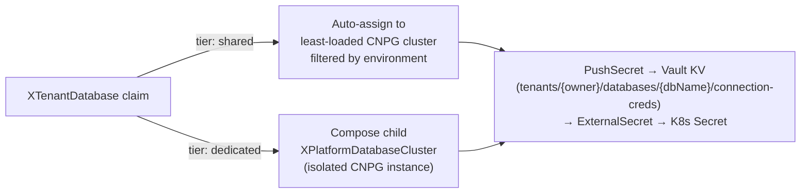

# XTenantDatabase

Tenant-facing PostgreSQL database with dynamic tier resolution, Vault-backed
credentials, and ESO sync. Supports two deployment models: `shared` (auto-assign
to a least-loaded pool cluster) and `dedicated` (compose an isolated CNPG cluster
as a child resource).

| | |
|---|---|
| **Group** | `platform.wxops.cloud` |
| **Kind** | `XTenantDatabase` |
| **Plural** | `xtenantdatabases` |
| **Scope** | `Cluster` |
| **API version** | `v1alpha1` (served, storage) |
| **Composition functions** | `function-extra-resources` (shared cluster discovery) + `function-kcl` |

## Tier model



**Shared** — `function-extra-resources` discovers all `XPlatformDatabaseCluster`
resources labeled `wxops.cloud/managed-by: platform-database-clusters` and
`shared: true`, counts existing tenant databases per cluster, and assigns to the
least-loaded one matching the claim's `environment`. The assignment is sticky —
once resolved, subsequent reconciles reuse the same cluster.

**Dedicated** — composes a child `XPlatformDatabaseCluster` for full isolation.
Sized via `dedicatedCluster.*` fields.


## `spec.parameters`

### Tier resolution

| Field | Type | Required | Default | Description |
|---|---|---|---|---|
| `tier` | `string` | | `"shared"` | `shared` or `dedicated`. |
| `environment` | `string` | | `"dev"` | One of `dev`, `staging`, `prod`. For `shared`, filters the pool to clusters matching this environment. For `dedicated`, passed to the child cluster. |
| `dedicatedCluster.instances` | `integer` (1–9) | | `1` | PostgreSQL instances. `1` = standalone, `3` = HA. Only used when `tier: dedicated`. |
| `dedicatedCluster.storageSize` | `string` | | `"8Gi"` | PVC storage per instance. Only used when `tier: dedicated`. |
| `dedicatedCluster.postgresVersion` | `integer` | | `16` | PostgreSQL major version. Only used when `tier: dedicated`. |
| `dedicatedCluster.enablePooler` | `boolean` | | `true` | Deploy a PgBouncer RW pooler. Only used when `tier: dedicated`. |
| `dedicatedCluster.namespace` | `string` | | `"cnpg-system"` | Namespace for the dedicated cluster. Only used when `tier: dedicated`. |
| `clusterRef` | `string` | | | Name of an `XPlatformDatabaseCluster` to target directly. When set (with `clusterNamespace`), bypasses all tier logic. |
| `clusterNamespace` | `string` | | | Namespace of the target CNPG cluster. Required when `clusterRef` is set. |

### Database

| Field | Type | Required | Default | Description |
|---|---|---|---|---|
| `dbName` | `string` | yes | | PostgreSQL database name. Must be unique per cluster. |
| `owner` | `string` | yes | | Team or project identifier (e.g. `"rocket-team"`). Scopes the Vault path and PostgreSQL role name. |
| `extensions` | `array<string>` | | `[]` | PostgreSQL extensions to enable (e.g. `[uuid-ossp, pgcrypto, postgis]`). |
| `databaseReclaimPolicy` | `string` | | `"retain"` | `retain` or `delete`. Controls what happens to the database, credentials Secret, and Vault entry when the XR is deleted. See below. |
| `vaultSecretStoreName` | `string` | | `"vault-cluster-store"` | Name of the ESO `ClusterSecretStore` used by the `PushSecret` that writes credentials to Vault. |

#### Reclaim policy

| Policy | On XR deletion |
|---|---|
| `retain` (default) | Database, role, and credentials Secret survive XR deletion — manual cleanup required if the tenant is decommissioned. Stale Vault entry must also be manually deleted. |
| `delete` | CNPG drops the database and role; credentials Secret and Vault entry are removed. Two `ClusterUsage` ordering constraints ensure `DROP DATABASE` completes before `DROP ROLE`, and `DROP ROLE` completes before credentials cleanup — preventing the `2BP01` parallel-deletion race. |

:::caution[Vault entry on retain→delete transition]
Switching from `retain` to `delete` and then deleting the XR cleans up Kubernetes resources but **does not remove the Vault entry** — the PushSecret's `deletionPolicy` update is not retroactive for entries written under `None`. Manual cleanup required:
```bash
vault kv metadata delete tenants/{owner}/databases/{dbName}/connection-creds
```
:::


## Credential flow

```
XTenantDatabase
  └─ PushSecret (provider-kubernetes)
       └─ Vault KV: tenants/{owner}/databases/{dbName}/connection-creds
            └─ ExternalSecret (ESO)
                 └─ K8s Secret: {appName}-db-creds  (in the tenant namespace)
```

Wire to `XTenantApp` via `secretsFrom.database.enabled: true` — `XTenantApp`
adds `envFrom.secretRef: {appName}-db-creds` without managing the Secret itself.

:::warning[Go-live ordering]
`XTenantDatabase` must be applied and reach `Ready` before the `XTenantApp`
Deployment starts — otherwise Pods fail with `CreateContainerConfigError: secret not found`.
GitOps sync wave ordering or an `ArgoCD sync-wave` annotation on the XTenantApp
Application ensures this.
:::


## Required discovery labels

`function-extra-resources` requires these labels in the XR manifests — they cannot be set by the Composition:

| Resource | Required label | Purpose |
|---|---|---|
| `XPlatformDatabaseCluster` | `wxops.cloud/managed-by: platform-database-clusters` | Discovered as a candidate for `tier: shared` pool |
| `XTenantDatabase` | `wxops.cloud/tenant-database: "true"` | Counted for per-cluster load balancing and `dbName` collision detection |

Without the `XTenantDatabase` label, single-database scenarios still work but collision detection and load balancing across clusters are disabled.


## Examples

### Shared tier (default)

```yaml
apiVersion: platform.wxops.cloud/v1alpha1
kind: XTenantDatabase
metadata:
  name: payment-api-db
  labels:
    wxops.cloud/tenant-database: "true"
spec:
  parameters:
    tier: shared
    environment: dev
    dbName: payment_api
    owner: rocket-team
    extensions:
      - uuid-ossp
      - pgcrypto
```

### Dedicated tier

```yaml
apiVersion: platform.wxops.cloud/v1alpha1
kind: XTenantDatabase
metadata:
  name: analytics-db
  labels:
    wxops.cloud/tenant-database: "true"
spec:
  parameters:
    tier: dedicated
    environment: staging
    dbName: analytics
    owner: data-team
    databaseReclaimPolicy: retain
    dedicatedCluster:
      instances: 3
      storageSize: 50Gi
      postgresVersion: 16
      enablePooler: true
```

## See also

- [XTenantApp](./xtenant-app) — wire the resulting Secret via `secretsFrom.database`
- [XPlatformDatabaseCluster](./xplatform-database-cluster) — the platform clusters tenants land on, and the vision of PostgreSQL as a multi-modal data platform
- [Crossplane APIs](./crossplane-apis) — package catalog and tier diagram
- [Platform Features](../scaffolding/features) — scaffold wizard database configuration
