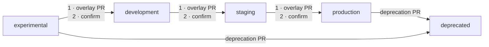

# Lifecycle & Cache Webhook

:::info[v0.3.0 change]
`POST /api/v1/webhooks/promote/:kind/:name` was removed in v0.3.0. Lifecycle
promotion is now fully UI-driven via the Promotion panel on each Component detail
page. The only remaining webhook is the catalog cache refresh endpoint.
:::

## How Lifecycle Promotion Works

Lifecycle transitions are a two-step flow in the Promotion panel — not an automated webhook.



### Step 1 — Create overlay PR

Open the **Promotion panel** on the Component detail page and click **Create overlay**
for the target environment. The portal:

1. Generates the Kustomize overlay files (`kustomization.yaml`, `image-transformer.yaml`, `patch-xtenant-app.yaml`)
2. Writes Vault secrets for that environment (if provided)
3. Opens a `[Promote] {team}/{app} → {env}` PR in `gitops-infra`

Platform-team reviews and merges the PR.

### Step 2 — Confirm

Once merged, the Promotion panel shows a **Confirm** button. Clicking it:

1. Verifies the overlay file is present on `main` in `gitops-infra`
2. Updates the catalog entity lifecycle field
3. Clears the confirm button and refreshes the panel

If the PR is still open, the panel shows **PR #N pending** and the Confirm button is disabled.

## Permission Matrix

| Transition | Who can trigger |
|---|---|
| `experimental` → `development` | Any team member |
| `development` → `staging` | Platform-team or `{team}:Managers` |
| `staging` → `production` | Platform-team or `{team}:Managers` |
| Deprecation | Platform-team or `{team}:Managers` |

## Overlay Configuration

The overlay wizard exposes per-environment settings committed into the Kustomize overlay:

| Field | Notes |
|---|---|
| Replicas | Per-environment pod count |
| Ingress host | Per-environment hostname |
| CPU / memory limits | Per-environment resource requests and limits |
| Vault secrets | Written to `{team}/{app}/{env}/env` at creation |
| Database | Shared or dedicated CNPG tier, per-environment naming |

See [Environment Promotion](../scaffolding/promotion) for the full overlay structure.

## Catalog Cache Refresh Webhook

The only active webhook endpoint is the **catalog cache invalidation** call.
It flushes the in-memory 5-minute TTL cache so new catalog entities appear
immediately after a `gitops-infra` push — without waiting for the next cache cycle.

```
POST /api/v1/webhooks/catalog/refresh
Authorization: Bearer <WEBHOOK_TOKEN>
```

### Gitea webhook setup (one-time, platform-team)

1. `gitops-infra` → **Settings** → **Webhooks** → **Add webhook**
2. **URL:** `https://<portal-host>/api/v1/webhooks/catalog/refresh`
3. **Content type:** `application/json`
4. **Secret / Authorization:** `Bearer <WEBHOOK_TOKEN>`
5. **Trigger:** Push events — optionally restrict to `catalog/**` paths

### Token configuration

| Location | Variable | Purpose |
|---|---|---|
| Portal backend (env) | `WEBHOOK_TOKEN` | Validates incoming `catalog/refresh` calls |
| `gitops-infra` repo secrets | `PORTAL_WEBHOOK_TOKEN` | Passed as `Bearer` header by CI |

```bash
# Generate a new token if not already set
TOKEN=$(openssl rand -hex 32)

# Set in the portal deployment
kubectl create secret generic wxops-portal-secrets \
  --from-literal=webhook-token=$TOKEN \
  --namespace wxops-system

# Set in gitops-infra → Settings → Secrets → Actions
# PORTAL_WEBHOOK_TOKEN = $TOKEN
```

`WEBHOOK_TOKEN` is the same variable previously used for lifecycle promotion webhooks —
no new secret is needed if it was already configured.

## Migrating from v0.2.x

If you had a CI workflow in `gitops-infra` calling
`POST /api/v1/webhooks/promote/:kind/:name`, it can be safely removed.

Existing services that already have `overlays/dev/` on `main` and are currently
`experimental` can be reconciled in one click: open the Promotion panel and click
**Confirm** — the portal detects the existing overlay and advances the lifecycle to
`development` without creating a new PR.
