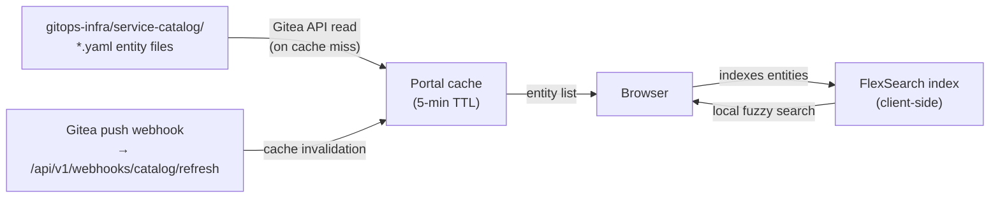

# Service Catalog

The W'xOps Service Catalog is a searchable, filterable registry of every service,
API, database, team, and document in your organization. It reads
Backstage-compatible YAML from your `gitops-infra` repository — no database,
no plugin, no catalog server.

## How It Works



- The portal reads all YAML files from `service-catalog/` on first request and
  caches for 5 minutes.
- A Gitea push webhook calls `/api/v1/webhooks/catalog/refresh` to invalidate
  immediately on every push to `gitops-infra`.
- Search runs in-browser with FlexSearch — no round-trip per keystroke.

## Entity Types

| Kind | What it represents |
|---|---|
| `Component` | A service, library, or batch job |
| `API` | An OpenAPI, gRPC, or async API spec |
| `Resource` | A database, object store, queue, or Vault path |
| `System` | A product made up of related components |
| `Group` | A team or organization unit |
| `User` | A team member |
| `Location` | A pointer to a directory of entity files |
| `Template` | A scaffold template entry |
| `Document` | An RFC, ADR, or Runbook |

## Entity File Format

Entities follow the Backstage `backstage.io/v1alpha1` schema. The portal
extends it with `wxops.cloud/` annotations.

### Component example

```yaml
apiVersion: backstage.io/v1alpha1
kind: Component
metadata:
  name: payment-api
  description: |
    Handles payment processing for checkout flows.
  annotations:
    wxops.cloud/scaffold-template: go-grpc-service
    wxops.cloud/scaffold-date: "2025-06-10"
    wxops.cloud/gitea-repo: wxops/payment-api
    wxops.cloud/vault-path: wxops/payment-api/dev
    wxops.cloud/lifecycle: development
spec:
  type: service
  lifecycle: development
  owner: group:wxops/rocket-team
  system: payments
  providesApis:
    - payment-api-v1
  dependsOn:
    - resource:payment-db
    - component:identity-service
```

### API example

```yaml
apiVersion: backstage.io/v1alpha1
kind: API
metadata:
  name: payment-api-v1
  annotations:
    wxops.cloud/gitea-repo: wxops/payment-api
    wxops.cloud/openapi-path: api/openapi.yaml
spec:
  type: openapi
  lifecycle: development
  owner: group:wxops/rocket-team
  system: payments
  definition: |
    openapi: "3.0.0"
    info:
      title: Payment API
      version: "1.0.0"
    paths: {}
```

### Resource example

```yaml
apiVersion: backstage.io/v1alpha1
kind: Resource
metadata:
  name: payment-db
  annotations:
    wxops.cloud/vault-path: wxops/payment-api/dev
spec:
  type: database
  lifecycle: development
  owner: group:wxops/rocket-team
  system: payments
  dependsOn:
    - component:payment-api
```

## Entity Detail Page

Each entity has a detail page with:

| Card | Content |
|---|---|
| Overview | Description, owner, lifecycle, system, type |
| Relations | Dependencies, provides, consumes (graph) |
| Scaffold info | Template used, date scaffolded, gitops-infra commit |
| CI/CD | Latest workflow runs and image tags per branch |
| Cluster status | ArgoCD sync status, health, deployed revision (per env) |
| Activity | Recent PRs, promotions, config changes (role-gated) |
| Docs | Linked RFC/ADR/Runbook rendered as Markdown |
| Promotion | Lifecycle transition panel (role-gated) |
| OpenAPI | Interactive Swagger UI (for API kind) |
| Config | Editable overlay config (platform team only) |

## Lifecycle States

| Lifecycle | Who can set | Meaning |
|---|---|---|
| `experimental` | Any developer | Proof-of-concept, may be removed |
| `development` | Developer (via promotion panel) | Active development, `dev` overlay exists |
| `staging` | `platform-team` or `{team}:Managers` | Staging overlay promoted, RC image tagged |
| `production` | `platform-team` or `{team}:Managers` | Production overlay promoted, stable image |
| `deprecated` | Platform team | Retained for reference, not running |

The portal enforces lifecycle gating — non-manager developers cannot promote
past `experimental`.

## Catalog Directory Layout

```
gitops-infra/
└── service-catalog/
    ├── groups/
    │   └── rocket-team.yaml
    ├── users/
    │   └── alice.yaml
    ├── systems/
    │   └── payments.yaml
    └── components/
        ├── payment-api/
        │   ├── component.yaml
        │   ├── api.yaml
        │   └── resource-db.yaml
        └── identity-service/
            └── component.yaml
```

Subdirectory layout is convention — the portal reads all `*.yaml` files
recursively and recognizes entities by their `kind:` field.
