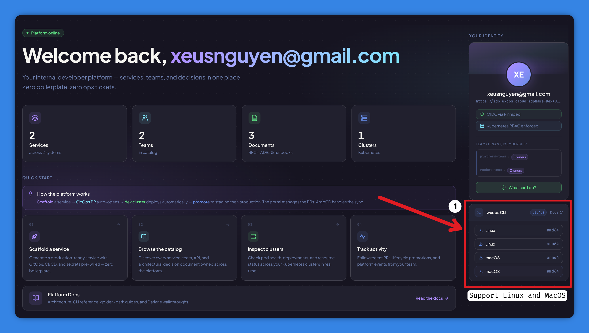

# `wxops` CLI

`wxops` is a thin terminal client for the W'xOps Internal Developer Portal.
It talks to the **same REST API and the same authentication model** as the portal
UI — there is no separate credential system, no kubeconfig required, no direct
Gitea access needed.

## What it's for

The CLI exists for three situations where opening a browser is inconvenient:

| Situation | Commands |
|---|---|
| **Browse the catalog from the terminal** — search entities, check lifecycle, inspect owners | `wxops catalog list`, `wxops catalog get` |
| **Get the exact kubectl / mirrord commands for a service** without reading Kubernetes resources yourself | `wxops debug`, `wxops darlane status` |
| **Active file sync** during inner-loop development — watch local files and stream changes into the Darlane debug pod | `wxops darlane sync`, `wxops darlane push`, `wxops darlane restart` |

The CLI **never writes to Kubernetes directly**. Darlane enable/disable, overlay
creation, and lifecycle promotion remain portal UI operations. The CLI's write
operations are limited to one action: `wxops update` replaces the CLI binary itself.

:::note[No `kubectl` needed for catalog commands]
`wxops catalog list` and `wxops debug` derive the namespace, deployment name, and
port from the catalog entity — they do not call the Kubernetes API. You need
`kubectl` in your PATH only for `darlane sync`, `darlane push`, `darlane logs`,
`darlane exec`, `darlane restart`, and `darlane port-forward`.
:::


## Installation

The download endpoint is **session-gated** — it proxies the Gitea release binary
through the portal using its own service-account token, so you never need direct
Gitea access. But the proxy requires an active portal session.

### Option A — Portal UI (recommended for first install)



Log in to the portal in your browser, go to **Overview → Download CLI**, and click
the button for your platform. The browser forwards your session cookie automatically.

Supported: `linux-amd64`, `linux-arm64`, `darwin-amd64`, `darwin-arm64`.

### Option B — Gitea release page (platform team / direct Gitea access)

Download directly from the release assets in Gitea — no portal session needed.

### Option C — Build from source

```bash
# From the repo root
make cli-build     # → cli/bin/wxops
make cli-install   # → GOPATH/bin/wxops

# Or from inside cli/
cd cli && make build
```

Version is stamped from the nearest git tag via `-ldflags "-X main.version={tag}"`.

:::caution[Why bare curl returns 401]
`curl https://portal.example.com/api/v1/cli/download/linux-amd64` fails with
**401**. The download route sits behind the same `RequireSession` middleware as
every other portal API — no session cookie, no binary.
:::


## Authentication

```bash
# First-time login — portal URL is required
wxops login --portal https://portal.example.com

# Re-authenticate using the saved portal URL
wxops login
```

Opens the system browser to the portal's OIDC flow. After login, the session token
is saved to `~/.wxops/credentials.json`:

```json
{
  "portal_url": "https://portal.example.com",
  "token": "<wxops_session_value>"
}
```

The token is the same `wxops_session` cookie the browser uses. Run `wxops login`
again when it expires — there is no auto-refresh.

**CI/CD environments** — skip the browser flow with environment variables:

```bash
export WXOPS_PORTAL_URL=https://portal.example.com
export WXOPS_TOKEN=<token>
wxops catalog list --kind Component
```

`WXOPS_TOKEN` always takes precedence over the credentials file.


## Version

```bash
wxops version
# wxops version v0.4.2
```


## Update

```bash
wxops update          # prompts for confirmation
wxops update --yes    # skip confirmation (useful in scripts)
```

Checks the portal for the latest release, shows the current vs latest version,
then downloads and atomically replaces the current binary. Uses the stored session
token — no Gitea access needed. Requires an existing install (use Option A or B
above for first install).


## Catalog

Catalog commands read from the portal's `/api/v1/catalog/entities` endpoint — the
same data the UI shows. Useful for catalog exploration in scripts or terminals.

### `catalog list`

```bash
wxops catalog list
wxops catalog list --kind Component
wxops catalog list --kind Component --lifecycle production
```

```
KIND        NAME              LIFECYCLE    OWNER                DESCRIPTION
----        ----              ---------    -----                -----------
Component   payment-api       production   wxops:rocket-team    Payment processing service
Component   auth-service      production   wxops:platform-team  Identity and token management
API         payment-api-v1    production   wxops:rocket-team    OpenAPI spec for payment-api
```

| Flag | Description |
|---|---|
| `--kind` | Filter by kind: `Component`, `API`, `Resource`, `Group`, `User`, `System` |
| `--lifecycle` | Filter by lifecycle: `experimental`, `development`, `staging`, `production` |

### `catalog get`

```bash
# Both kind and name are required
wxops catalog get Component payment-api
wxops catalog get API payment-api-v1
```

```
Kind:        Component
Name:        payment-api
Title:       Payment API
Lifecycle:   production
Owner:       wxops:rocket-team
Type:        service
Description: Payment processing service
Source:      wxops/payment-api
```


## Debug

`wxops debug` is the quickest way to get the right `kubectl` and `mirrord` commands
for a service. It reads the catalog entity to derive the namespace and port, checks
the Darlane status per environment, and prints ready-to-run commands.

No cluster API call required — namespace is derived from the owner group
(`org:team` → `tenant-{org}`), port from the `wxops.cloud/container-port` annotation.

```bash
wxops debug payment-api
wxops debug payment-api --env staging
```

| Flag | Short | Default | Description |
|---|---|---|---|
| `--env` | `-e` | `dev` | Target environment: `dev`, `staging`, `production` |

**Sample output:**

```
Darlane debug  payment-api
Namespace       tenant-wxops
Deployment      payment-api-darlane
Lifecycle       production

Darlane status
  dev          ✓  enabled
  staging      ·  overlay exists — Darlane not enabled
  production   —  no overlay

Commands (dev)

  # Exec (bash)
  kubectl -n tenant-wxops exec -it deployment/payment-api-darlane -- bash

  # Port-forward
  kubectl -n tenant-wxops port-forward deployment/payment-api-darlane 8080:8080

  # Traffic mirror (mirrord)
  mirrord exec \
    --target deployment/payment-api-darlane \
    --target-namespace tenant-wxops \
    -- <your-start-command>

  # File sync — watch local files and stream changes into the pod
  wxops darlane sync payment-api
```


## Darlane commands

The `darlane` subcommands handle the **active inner-loop development** workflow:
syncing local files into a Darlane pod, streaming logs, restarting, and checking
status. All commands resolve the namespace and deployment name from the catalog
entity — you don't need to know or remember the Kubernetes resource names.

### Which tool for inner-loop work?

Darlane pods support two workflows. They are not redundant — pick by where your
code needs to run:

| | Mirrord | `wxops darlane sync` |
|---|---|---|
| **Code runs on** | Your local machine | Inside the cluster pod |
| **What it provides** | Pod's network, env vars, secrets — tunnelled to your local process | Real-time file sync into the pod's writable volume |
| **When to use** | Step-debugging a real live request; workload needs Vault agent / Envoy / CNI to function | Workload has OS/arch/GPU dependencies that can't be reproduced locally |
| **Hot reload** | Your local toolchain (`uvicorn --reload`, `air`, `nodemon`) | The framework inside the pod handles it |

Both can be combined: `darlane sync` for continuous file sync + Mirrord for
intercepting a specific tricky request. They target the same debug pod.

---

### `darlane sync` — watch and stream file changes

The primary inner-loop command. Watches local files with `fsnotify`, batches
changes under a debounce window, and streams them into the Darlane pod using
`kubectl exec tar xf -`. No daemon, no sidecar, no extra tooling required.

```bash
wxops darlane sync payment-api
wxops darlane sync payment-api --local ./src --remote /app/src
wxops darlane sync payment-api --exclude '*.log' --exclude 'tmp/'
wxops darlane sync payment-api --no-initial-sync
wxops darlane sync payment-api --tail-logs   # stream pod logs alongside sync events
```

**Sample session:**

```
  darlane sync
  ──────────────────────────────────────────────────
  component     python-demo
  env           dev
  namespace     tenant-rocket-team
  deployment    python-demo-darlane
  sync          ./app  →  /app

  pre-flight
  ✓  catalog entity found
  ✓  darlane enabled for "dev"
  ✓  project: python
  ✓  tar available in pod
  ──────────────────────────────────────────────────

→  initial sync: 12 file(s)
   tip: if the pod doesn't hot-reload, restart it:
        wxops darlane restart python-demo --local ./app --remote /app

↑  synced 1 file(s): app/main.py
↑  synced 2 file(s): app/handler.py, app/util.py
✗  deleted 1 file(s): app/legacy.py
⚠  pod not ready, retrying (1/3)…
↑  synced 1 file(s): app/main.py
^C
stopped.
```

**Pre-flight checks** run before the watcher starts:

| Check | On fail |
|---|---|
| Catalog entity found | Soft warn — watcher still starts |
| Overlay exists in gitops-infra | Soft warn |
| `darlaneEnabled: true` in overlay | Soft warn |
| `--remote` matches `fileSync.mountPath` | Soft warn + hint showing the configured path |
| Local project language matches catalog tags | Soft warn — check you are in the right directory |
| `tar` available in the container image | **Hard fail** — prints `kubectl debug -it <pod> --image=busybox` command and exits |

**Behavior:**

- **Initial sync** — on startup all non-excluded local files are sent to the pod so the volume aligns with local state before incremental events begin. Skip with `--no-initial-sync` when the pod is already seeded.
- **Delete propagation** — locally deleted files are removed from the pod on the next flush via a single `kubectl exec rm -rf` (each path is a separate argv, not a shell argument — no injection risk).
- **Max-debounce cap** — if a burst (e.g. `go build`) keeps resetting the debounce timer, a flush is forced at the 2-second mark to prevent starvation.
- **Retry** — sync and delete are retried up to 3 times with a 2-second delay. The session survives a pod restart mid-session.
- **Pod-replaced re-seed** — if a retry succeeds after failures (pod was replaced), all local files are automatically re-seeded to the new pod. This fires regardless of `--no-initial-sync`.
- **Graceful shutdown** — `Ctrl-C` flushes any pending batch before exiting.

Built-in excludes (always skipped regardless of `--exclude`): `.git`, `node_modules`, `__pycache__`, `.next`, `vendor`.

| Flag | Short | Default | Description |
|---|---|---|---|
| `--env` | `-e` | `dev` | Target environment: `dev`, `staging`, `production` |
| `--namespace` | `-n` | _(derived from entity owner)_ | Override K8s namespace |
| `--deployment` | | _(derived)_ | Override deployment name |
| `--local` | | `.` | Local directory to watch |
| `--remote` | | `/app` | Remote path inside the container |
| `--debounce` | | `100` | Debounce interval in milliseconds |
| `--exclude` | | | Glob pattern to exclude (repeatable) |
| `--no-initial-sync` | | `false` | Skip the initial full sync on startup |
| `--tail-logs` | | `false` | Stream pod logs alongside file sync events |

---

### `darlane push` — one-shot sync (no watcher)

Same pre-flight checks and file sync as `darlane sync`, but exits after the
initial sync completes. Useful in CI pipelines or as a pre-step before starting
a local dev server.

```bash
wxops darlane push payment-api
wxops darlane push payment-api --local ./src --remote /app/src
```

Accepts the same `--env`, `--namespace`, `--deployment`, `--local`, `--remote`,
`--exclude` flags as `darlane sync`. On success, prints the restart hint when
Darlane is enabled.

---

### `darlane status` — status across environments

Fetches Darlane status per environment from the portal — overlay presence, Darlane
enabled flag, fileSync mount path, and current image tag.

```bash
wxops darlane status payment-api
```

```
  darlane status  python-demo
  ──────────────────────────────────────────────────

  dev
    ✓  overlay  ✓  darlane enabled  ·  filesync /app
    image        dev-2026-07-09_14-32-01-a1b2c3d

  staging
    ✓  overlay  –  darlane not enabled
    image        v0.2.1-rc1  (2026-07-08)

  production
    –  no overlay — create via portal Promotion panel

  lifecycle  production
  ──────────────────────────────────────────────────
```

---

### `darlane logs` — stream pod logs

Wraps `kubectl logs -f` with the namespace and deployment name derived from the
catalog entity.

```bash
wxops darlane logs payment-api
wxops darlane logs payment-api --no-follow --tail 50
wxops darlane logs payment-api --env staging
```

| Flag | Short | Default | Description |
|---|---|---|---|
| `--env` | `-e` | `dev` | Target environment |
| `--namespace` | `-n` | _(derived)_ | Override K8s namespace |
| `--follow` | `-f` | `true` | Stream logs continuously |
| `--tail` | | `100` | Number of recent lines to show on start |

---

### `darlane restart` — rollout restart and re-seed

Triggers `kubectl rollout restart`, waits for the rollout to complete, then
**automatically re-seeds all local files** into the new pod from the session
saved by the last `sync` or `push` run.

```bash
wxops darlane restart payment-api
wxops darlane restart payment-api --env staging
```

```
↻  restarting tenant-wxops/payment-api-darlane…
deployment "payment-api-darlane" successfully rolled out
⟳  re-seeding: 42 file(s)…
✓  done
```

Session state is read from `~/.wxops/darlane-{service}-{env}.json` — written by
`sync` and `push`. Pass `--local` / `--remote` / `--exclude` to override the
saved values.

:::tip[Use this instead of raw kubectl rollout restart]
`kubectl rollout restart` resets the pod to bare image state — no re-seed.
`wxops darlane restart` restarts and re-seeds in one step so the pod returns
to the same state your last sync session left it in.
:::

| Flag | Short | Default | Description |
|---|---|---|---|
| `--env` | `-e` | `dev` | Target environment |
| `--namespace` | `-n` | _(derived)_ | Override K8s namespace |
| `--local` | | _(from last session)_ | Override local directory |
| `--remote` | | _(from last session)_ | Override remote path |
| `--exclude` | | _(from last session)_ | Override exclude patterns |

---

### `darlane exec` — interactive shell

Opens an interactive `bash` shell in the Darlane pod via `kubectl exec -it`.

```bash
wxops darlane exec payment-api
wxops darlane exec payment-api --env staging
```

:::note[Distroless / scratch images have no shell]
Use `kubectl debug -it <pod-name> -n <namespace> --image=busybox --target=<container>` instead.
Running `wxops darlane sync` will detect the missing `tar` and print the exact command for you.
:::

---

### `darlane port-forward` — forward a local port

Forwards a local port to the Darlane pod, bypassing the Traefik ingress — always
hits the Darlane pod directly.

```bash
wxops darlane port-forward payment-api
wxops darlane port-forward payment-api --port 3000:8080
```

Default port is read from the `wxops.cloud/container-port` annotation on the
catalog entity; falls back to `8080:8080`.

| Flag | Short | Default | Description |
|---|---|---|---|
| `--env` | `-e` | `dev` | Target environment |
| `--namespace` | `-n` | _(derived)_ | Override K8s namespace |
| `--port` | `-p` | _(from catalog annotation)_ | Port mapping `local:remote` |


## Configuration

| Source | How to set |
|---|---|
| Portal URL + token | Written to `~/.wxops/credentials.json` by `wxops login` |
| `WXOPS_TOKEN` | Env var — overrides the credentials file; useful in CI |
| `WXOPS_PORTAL_URL` | Env var — required when `WXOPS_TOKEN` is set |


## Limitations

| Gap | Notes |
|---|---|
| No `wxops darlane enable` / `disable` | Enable Darlane via the portal UI Promotion panel. CLI is read-only for Darlane config. |
| Token does not auto-refresh | Re-run `wxops login` when the session expires. |
| `darlane sync` / `push` / `restart` require `kubectl` in PATH | The current kube context must have access to the target namespace. |
| `darlane exec` always opens `bash` | Some images have no shell — use `kubectl debug` with a busybox sidecar instead. |
| Shell completion not auto-installed | Run `wxops completion bash` (or `zsh`, `fish`) and source the output manually. |


## See also

- [Darlane Overview](../darlane/overview) — what Darlane is, how to enable it, Mirrord vs file sync
- [Permissions & RBAC](../security/permissions) — what each portal role can do
