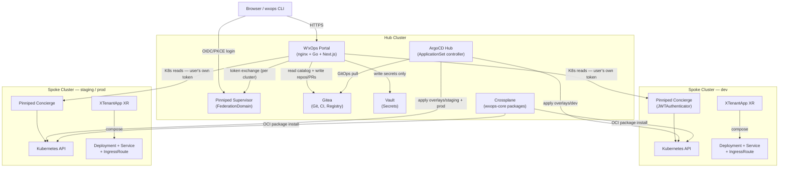
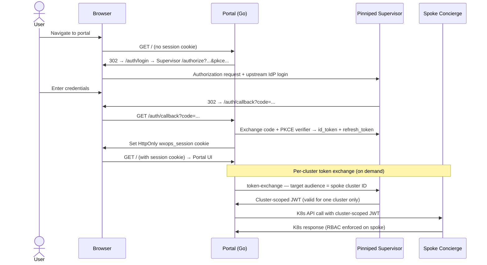
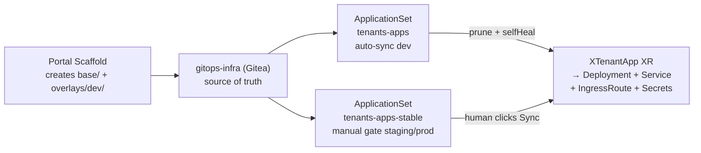
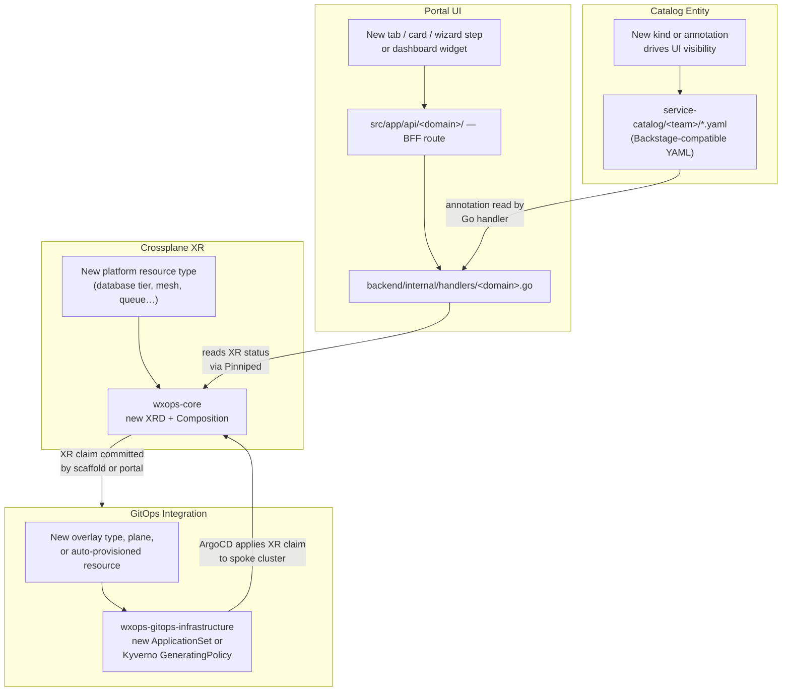

# Architecture

## Hub-Spoke Topology



Most multi-cluster platforms require a privileged agent on every spoke. W'xOps does not. The only components needed on a spoke are **Pinniped Concierge** (validates JWTs) and the **Crossplane OCI package** (installed by ArgoCD). No portal sidecar, no shared service account, no cluster-admin credential stored anywhere.

| Layer | Hub | Spoke |
|---|---|---|
| Identity | Pinniped Supervisor (OIDC federation) | Pinniped Concierge (JWTAuthenticator) |
| GitOps control | ArgoCD (all ApplicationSets live here) | Receives manifests via ArgoCD |
| Platform API | Crossplane controller | Crossplane packages (OCI, via ArgoCD) |
| Observability | Portal reads cluster APIs via Pinniped | No agent — portal proxies on behalf of the user |

Spoke clusters are registered as K8s Secrets labelled `wxops.cloud/kind=cluster`. Each Secret carries the API server endpoint, CA bundle, and a unique JWTAuthenticator audience — one Secret registration drives both the portal cluster tabs and the ArgoCD cluster credential.

:::tip
Full Secret schema, CA bundle modes, and RBAC setup — [Cluster Registry](../platform/cluster-registry).
:::


## Authentication Flow



- PKCE with S256 — client secret is never in the browser
- `wxops_session` is `HttpOnly` — browser JavaScript cannot read it
- Every cluster read uses the user's own token; a token for dev is cryptographically rejected by staging's Concierge
- Gitea groups flow through the OIDC token as `orgName:teamName` claims — see [Identity and Catalog](./identity-and-catalog) for group-to-namespace mapping


## Multi-Cluster Delivery

The same service definition deploys to dev, staging, and production through three cooperating layers.



**Overlay structure** — the portal scaffold commits `base/` (env-agnostic claim) + `overlays/dev/` (env-specific patch). Promotion to staging/prod creates additional overlay directories. ArgoCD ApplicationSets discover directories automatically via git-dir generator — adding a directory provisions an Application; removing it prunes it.

**ApplicationSets** — two sets at sync wave 5: `tenants-apps` auto-syncs dev (changes visible within seconds of a merge); `tenants-apps-stable` detects OutOfSync but waits for a human Sync click on staging/prod.

**Crossplane XR** — ArgoCD delivers `XTenantApp` claim manifests to each spoke. Crossplane expands each claim into ~6–8 Kubernetes resources (Deployment, Service, IngressRoute, Certificate, ExternalSecret, optional Darlane twin). Platform teams update the Composition once; all tenants get the update on the next sync.

**Multi-cluster scaling** — a matrix generator pairs each overlay path with the ArgoCD cluster Secret carrying a matching `environment: dev|staging|production` label. Adding a new cluster requires only creating a labelled cluster Secret — no changes to the ApplicationSet.

:::tip[Deep dives]
- Overlay anatomy and Image Updater wiring — [Platform Features](../scaffolding/features)
- ApplicationSet planes, RBAC, Vault/ESO secrets — [GitOps Infrastructure](../platform/gitops-infrastructure)
- XTenantApp Composition breakdown, KCL engine — [Crossplane APIs](../api/crossplane-apis)
- Scaffold wizard that generates the initial overlay — [Golden-Path Scaffolding](../scaffolding/golden-path)
:::


## Portal Process Model and BFF

Three processes share one container on loopback:

```
nginx :80       → routes browser traffic; the only public entry point
Go :8080        → auth, catalog, scaffold, cluster, webhook handlers
Next.js :3000   → pages, server components, BFF route handlers
```

**Why nginx?** The Go backend runs on an internal loopback address that browser JavaScript can never reach. The `wxops_session` cookie is `HttpOnly` so browser code cannot read it either. nginx acts as the integration layer that makes both constraints work together: it routes OIDC and direct API traffic (`/auth/*`, `/api/v1/*`) straight to Go, and routes interactive browser calls (`/api/*`) to Next.js BFF route handlers that run on the server, read the cookie from `next/headers`, and proxy to Go on the user's behalf. The browser never sees the backend URL or the session token value — nginx enforces this boundary at the edge.

**Two fetch paths:**

| Path | When | How |
|---|---|---|
| A — Server Component | Data needed at page render | `async` component calls Go directly over loopback, forwards session cookie |
| B — BFF Route Handler | Interactive or auto-refreshing data | Browser fetches `/api/…`; handler in `src/app/api/` reads cookie server-side, proxies to Go |

No client-side code ever calls Go directly. All 13 BFF routes in `src/app/api/` follow the same shape: read cookie → fetch `BACKEND_URL/api/v1/…` → return `NextResponse.json`.


## Security Boundaries

| Boundary | Rule |
|---|---|
| Portal → K8s | Read-only on all clusters. Never writes to any K8s API. |
| Portal → Vault | Write-only. Creates/updates KV v2 secrets. Never reads or deletes. |
| Portal → Gitea | Read + write. Always verifies remote resource exists before touching Vault. |
| Lifecycle promotion | Only `platform-team` or `{team}:Managers` can promote past `experimental`. |
| gitops-infra PR URLs | Never surfaced to tenant users — portal returns status text only. |


## Extending the Portal

The portal is a **programmable platform layer**. Every capability in the UI today — catalog browsing, scaffold wizard, cluster inspection, Darlane debug, lifecycle promotion — was added through the same four extension surfaces. Anyone with access to the codebase can add a new capability without touching existing features.

### The four surfaces



### Example: adding service mesh visibility

This is what a complete new capability looks like across all four surfaces:

| Surface | What you add | Result |
|---|---|---|
| Crossplane XR | `XServiceMesh` XRD + Composition in `wxops-core` | Istio `VirtualService` + `PeerAuthentication` provisioned per app, same as `XTenantApp` |
| GitOps | `base/xservice-mesh.yaml` claim generated by scaffold | ArgoCD applies it to each spoke; Crossplane expands it |
| Catalog entity | `wxops.cloud/mesh-enabled: "true"` annotation on Component | Portal reads the annotation to decide whether to show the Mesh tab |
| Portal UI | Go handler reads mesh CRs via Pinniped; BFF route at `/api/catalog/entities/[kind]/[name]/mesh`; client component renders traffic metrics | Developers see live mesh status on their service page |

Each surface is independent. The mesh XR can ship before the portal UI tab is built. The catalog annotation can be added manually before scaffold supports it. Nothing is coupled to a deploy sequence.

### What this means for stakeholders

- **New infrastructure resource type** → add an XRD + Composition to `wxops-core`. Platform engineers write it once; every tenant gets it as a form field in the scaffold wizard.
- **New developer visibility surface** → add a Go handler + BFF route + UI card. No schema changes, no database migrations, no infrastructure changes.
- **New automated provisioning rule** → add a Kyverno `GeneratingPolicy` to `wxops-gitops-infrastructure`. It runs on namespace creation automatically — no portal code change needed.
- **New catalog insight** → add an annotation convention to the entity YAML schema. Any CI job or tool that writes entities can populate it; the portal reads and renders it.

The platform grows incrementally. The four surfaces stay decoupled — a new XR does not require a portal release, and a new portal tab does not require a GitOps change.
