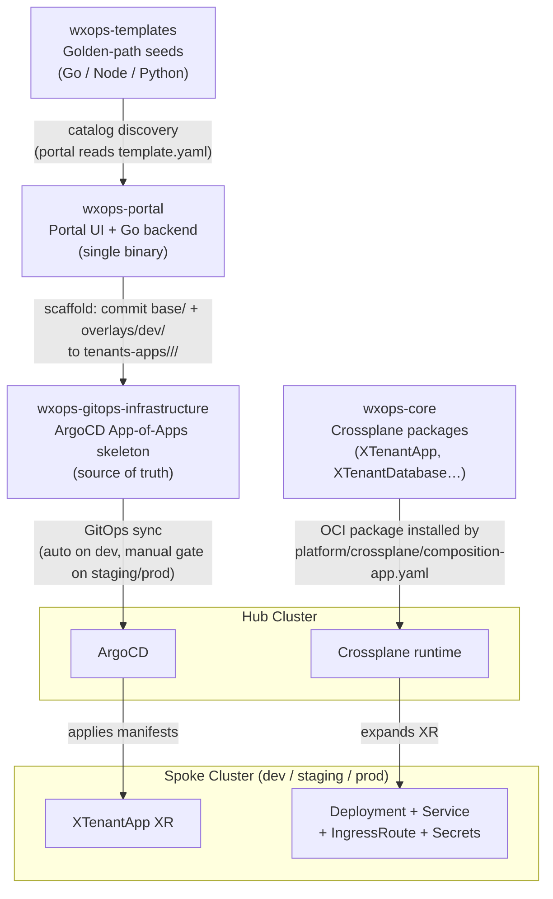

# Ecosystem Overview

W'xOps is not a single repo — it is four repos with well-defined responsibilities.
This page is the map.

## The Four Repos

| Repo | What it is | Who touches it |
|---|---|---|
| `wxops-templates` | Seed repos consumed by the scaffold wizard — Go, Node.js, Python golden-path starters | Platform team (add templates); developers (read-only via portal) |
| `wxops-portal` | The Internal Developer Portal — Next.js UI + Go backend, single binary. Borrows Backstage's entity schema (YAML kind + metadata + spec) and catalog concepts, but runs on its own Go + Next.js stack — **Backstage is not a runtime dependency** | Platform team |
| `wxops-gitops-infrastructure` | GitOps skeleton — the source of truth for every K8s resource on every cluster | Platform team (platform changes); portal (writes tenant app manifests) |
| `wxops-core` | Crossplane Configuration packages — XRDs + Compositions for XTenantApp, XTenantDatabase, XGiteaRepository | Platform team |

## Backstage Concepts, Not Backstage Runtime

W'xOps borrows the best idea from Backstage — a **uniform catalog schema** — without taking on Backstage as a dependency.

Backstage introduced the concept that every software asset (service, API, team, resource) can be described as a YAML file with a consistent shape: `apiVersion`, `kind`, `metadata.name`, `metadata.annotations`, and a `spec` that is specific to the kind. W'xOps uses exactly this schema (`backstage.io/v1alpha1`) so catalog entities are portable and familiar to any team that has seen Backstage before.

What W'xOps does **not** import:
- The Backstage Node.js monorepo or plugin runtime
- The Backstage PostgreSQL catalog database
- The Backstage deployment model (no `catalog-backend`, no Backstage app server)

The portal's catalog is a **Go service** that reads YAML entity files directly from Gitea and caches them in memory. There is no database, no plugin system, and no Backstage server process. The entity YAML schema is a contract, not a dependency.

This means:
- Any tool that speaks `backstage.io/v1alpha1` YAML can produce entities the portal reads (CI jobs, scaffold templates, manual files)
- The catalog starts in milliseconds with zero infrastructure beyond the portal binary
- Platform teams already familiar with Backstage schema can write entities immediately

## How They Connect

## End-to-End: A New App in 6 Steps

| Step | Who / what | What happens |
|---|---|---|
| 1. Pick a template | Developer in portal | Portal reads `template.yaml` from `wxops-templates`, renders the scaffold wizard |
| 2. Scaffold | Portal | Creates Gitea repo, Vault secrets, commits `base/` + `overlays/dev/` to `wxops-gitops-infrastructure` |
| 3. GitOps sync (dev) | ArgoCD | `tenants-apps` ApplicationSet discovers the new overlay; auto-syncs to dev cluster |
| 4. XR expansion | Crossplane + wxops-core | `XTenantApp` claim is expanded by the Composition into Deployment, Service, IngressRoute, optional Darlane twin |
| 5. CI builds image | Gitea Actions in the new repo | Pushes `dev-{date}-{sha7}` tag; ArgoCD Image Updater picks it up |
| 6. Promote | Developer via portal Promotion panel | Portal creates a gitops-infra PR to add `overlays/staging/`; platform team reviews and merges |

## Where to Go Next

| Topic | Doc |
|---|---|
| Portal auth, nginx routing, BFF pattern, security boundaries | [Architecture](./architecture) |
| Gitea group format, namespace mapping, catalog cache | [Identity and Catalog](./identity-and-catalog) |
| XTenantApp / XTenantDatabase parameters | [Platform Features](../scaffolding/features) |
| Crossplane package details (wxops-core) | [Crossplane APIs](../api/crossplane-apis) |
| GitOps planes, tenant provisioning, RBAC | [GitOps Infrastructure](../platform/gitops-infrastructure) |
| Template catalog and CI pipeline | [Service Templates](../scaffolding/templates) |
| Scaffold wizard walkthrough | [Golden-Path Scaffolding](../scaffolding/golden-path) |
| Darlane debug environments | [Darlane Overview](../darlane/overview) |
