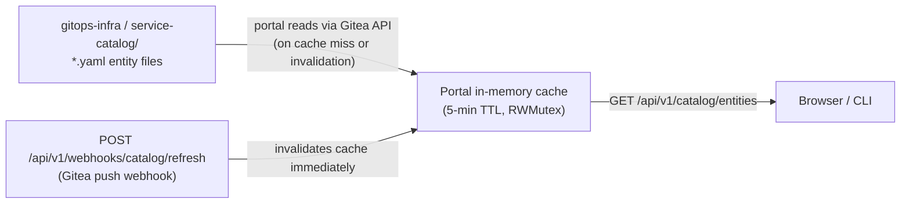

# Identity and Catalog

## Group Format and Namespace Mapping

Pinniped relays Gitea OIDC groups as exactly two levels: `orgName:teamName`. This
format drives namespace assignment, RBAC subject names, and role-gated actions
throughout the portal.

```
wxops:rocket-team    →  namespace: tenant-wxops   (org is the tenancy unit)
wxops:platform-team  →  platform-wide access
acme:backend-team    →  namespace: tenant-acme
acme:Managers        →  can promote acme services to staging/prod
```

**Namespace derivation** — the portal calls `groupToTenant()` in
`backend/internal/handlers/clusters.go` to derive the namespace from the org
segment. It never calls `GET /api/v1/namespaces` — for tenant users that either
returns all namespaces or a 403. Namespaces are always derived from group
membership instead.

**RBAC subjects** — ClusterRoleBindings on spoke clusters use the full
`orgName:teamName` string as the subject, not the bare team name. This is what
Pinniped Concierge impersonates after validating the cluster-scoped JWT.

**Platform check** — a user has platform-wide access if the `teamName` segment
(after `:`) equals `platform-team`, regardless of `orgName`.

**Promotion gate** — lifecycle promotion to `staging` or `production` requires the
user to be in `platform-team` or in the owning org's `Managers` sub-group
(`acme:Managers` can promote services owned by the `acme` org).

:::tip[Related]
For the RBAC ClusterRole manifests applied on each spoke and the `clusters.json`
development shortcut, see [Cluster Registry](../platform/cluster-registry).
:::


## Catalog Architecture

The portal catalog has no database and no catalog server. Entity YAML files stored
in Gitea are the source of truth. The portal holds a short-lived in-memory cache
so that list and detail requests do not hit Gitea on every page load.



**Cache invalidation** — wire a Gitea push webhook on the `gitops-infra` repository
to `POST /api/v1/webhooks/catalog/refresh` (authenticated with `WEBHOOK_TOKEN`).
On a push event the portal drops the cache immediately; the next request repopulates
it from Gitea. Without the webhook, changes become visible within the 5-minute TTL.

**Entity schema** — entities use the `backstage.io/v1alpha1` YAML schema (same
`apiVersion` / `kind` / `metadata` / `spec` shape as Backstage). The portal reads
them as plain YAML; no Backstage runtime is involved. See [Service Catalog](../catalog/service-catalog)
for the full entity kind reference and annotation conventions.
