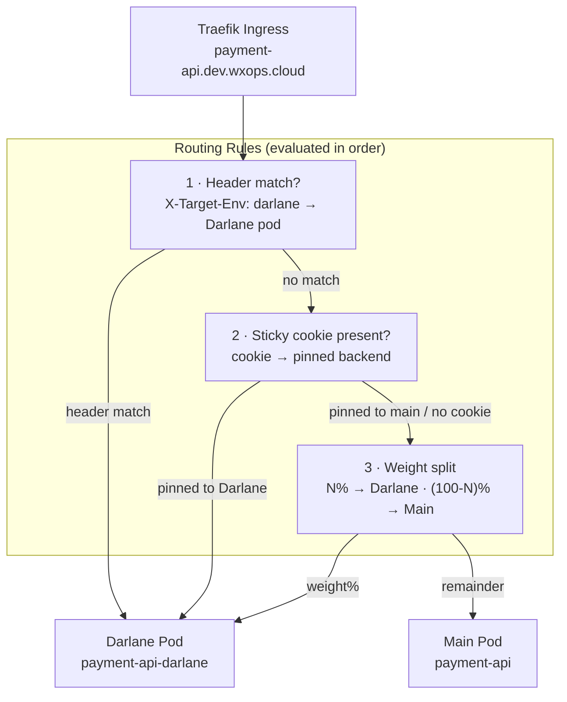

# A/B Testing & Traffic Routing

Darlane supports two traffic routing modes that can be used independently or together:

- **`trafficWeight`** — send a percentage of ingress traffic to the Darlane pod (session-level A/B split)
- **Header routing** — route specific requests to the Darlane pod based on an HTTP header (developer/QA targeting)

Both work through the same Traefik Ingress that serves your main deployment — no separate ingress or service needed.


## How Traffic Routing Works



Header routing takes priority over traffic weight. This lets you test the Darlane
variant directly without being affected by the random weight split.


## Traffic Weight

Set `trafficWeight` to send a percentage of ingress traffic to the Darlane pod.

```yaml
darlane:
  enabled: true
  replicas: 1
  trafficWeight: 20    # 20% of requests go to Darlane, 80% to main
```

The composition configures a Traefik `TraefikService` with a weighted backend.
The split is **request-level** by default — each request independently rolls the
percentage. Add sticky sessions (below) to make it **session-level** instead.

### Weight values

| Value | Effect |
|---|---|
| `0` | Darlane pod receives no traffic (default) — debug-only via exec/port-forward/header |
| `1–99` | A/B split between main and Darlane |
| `100` | All traffic goes to Darlane (full canary) — use with caution in shared clusters |

:::warning[`trafficWeight: 100` in a shared dev cluster]
Setting weight to 100 makes the Darlane pod the only backend. Every developer
and integration test hitting that service will reach your debug pod. Use this
only in isolated personal environments or with `productionOverride` review for
staging/prod.
:::


## Sticky Sessions

Without sticky sessions, each request independently rolls the weight split — a user
could see the main variant on one page and the Darlane variant on the next. Enable
sticky sessions to pin each user to one backend for their session.

```yaml
darlane:
  trafficWeight: 20
  stickySession:
    enabled: true
    cookieName: darlane-ab    # Traefik sets this cookie; app does not control the value
    secure: true              # HTTPS only
    sameSite: lax             # lax (default), strict, or none
```

Traefik sets the sticky cookie on the first response and reads it on subsequent requests
to route to the same backend. The cookie value is an opaque backend hash — your
application does not see or control it.

### Cookie options

| Field | Default | Notes |
|---|---|---|
| `cookieName` | `darlane-ab` | Override if multiple apps share the same domain to avoid cookie collisions |
| `secure` | `true` | Cookie sent over HTTPS only. Required when `sameSite: none` |
| `sameSite` | `lax` | `strict` prevents cross-origin requests from carrying the cookie; `none` requires `secure: true` |


## Header Routing

Header routing bypasses the weight split and routes requests carrying a specific
HTTP header directly to the Darlane pod. It works even with `trafficWeight: 0` —
real users are completely unaffected.

```yaml
darlane:
  headerRouting:
    enabled: true
    header: X-Target-Env      # HTTP header name (case-sensitive)
    value: darlane            # header value to match (case-sensitive)
```

### Sending targeted requests

```bash
# Target Darlane through the real ingress — no port-forward needed
curl -H "X-Target-Env: darlane" https://payment-api.dev.wxops.cloud/api/checkout

# Run your integration tests against the Darlane variant
pytest tests/ --base-url https://payment-api.dev.wxops.cloud \
  --headers '{"X-Target-Env": "darlane"}'
```

The portal's inline debug commands panel shows this `curl` pre-filled with your
actual hostname and configured header values.

### Custom header names

If multiple Darlane pods exist in the same cluster sharing an ingress domain,
use different header values (or different header names) to disambiguate:

```yaml
# payment-api Darlane
headerRouting:
  header: X-Target-Service
  value: payment-darlane

# order-service Darlane on the same domain
headerRouting:
  header: X-Target-Service
  value: order-darlane
```


## Combining Weight + Sticky + Header Routing

A typical A/B test setup for a dev cluster:

```yaml
darlane:
  enabled: true
  replicas: 1
  ttl: 24h
  trafficWeight: 10           # 10% of real users see the variant
  stickySession:
    enabled: true
    cookieName: darlane-ab    # same user always sees the same variant
  headerRouting:
    enabled: true
    header: X-Target-Env
    value: darlane            # QA and developers always hit Darlane with the header
  telemetryPort: "4318"       # OTEL collector — side-by-side metrics for the two variants
  env:
  - name: FEATURE_NEW_RANKING
    value: "true"
```

This setup:
1. Routes 10% of ingress traffic to the Darlane variant (sticky per session)
2. Lets QA and developers target Darlane with `X-Target-Env: darlane` regardless of the weight
3. Collects separate OTEL metrics for both variants via the telemetry port


## Observability: Side-by-Side Metrics

Set `telemetryPort` to have the Darlane pod expose a separate OTEL collector endpoint.
This lets you compare latency, error rate, and custom business metrics between the
main pod and the Darlane variant in Grafana.

```yaml
darlane:
  telemetryPort: "4318"    # OTEL GRPC port (quoted string)
```

The composition wires this port into the pod spec. Your application's OTEL SDK
sends traces and metrics to `localhost:4318` as normal — the composition routes
them to a separate Prometheus/OTEL pipeline labeled `variant=darlane`.


## Darlane A/B vs Production A/B (Argo Rollouts)

Darlane's traffic routing is a **developer debug tool**, not a production A/B mechanism.

| | Darlane `trafficWeight` | Argo Rollouts canary |
|---|---|---|
| Where it runs | Dev (or staging/prod with `productionOverride`) | Production |
| Traffic granularity | Session-level (sticky cookie) | Request-level or user-segment |
| Rollout control | Manual (portal Promotion panel) | Automated with analysis |
| Safety gate | `productionOverride: true` required | Rollout strategy in overlay |
| Kill switch | Portal → Disable Darlane | ArgoCD `kubectl argo rollouts abort` |
| Audience | Individual developer or QA session | All production users |
| Image isolation | Same image, different env vars | Separate canary image |

Use Darlane A/B for: **QA sign-off on a feature variant, stakeholder demo of a not-yet-shipped flag, developer load-testing a new code path against real dev traffic**.

Use Argo Rollouts for: **production gradual rollouts, automated canary analysis with Prometheus metrics, rollback on error-rate threshold**.


## Production and Staging Safety Gate

Enabling Darlane traffic routing on staging or production requires `productionOverride: true`
in the patch. The portal enforces this — only `{org}:Managers` or `platform-team` can
submit these changes.

```yaml
darlane:
  enabled: true
  replicas: 1
  trafficWeight: 5
  productionOverride: true    # required for staging and production
```

For staging/production, the portal opens a PR to `gitops-infra` instead of committing
directly. The PR must be reviewed and merged by a manager or platform-team member before
ArgoCD applies the traffic change.
