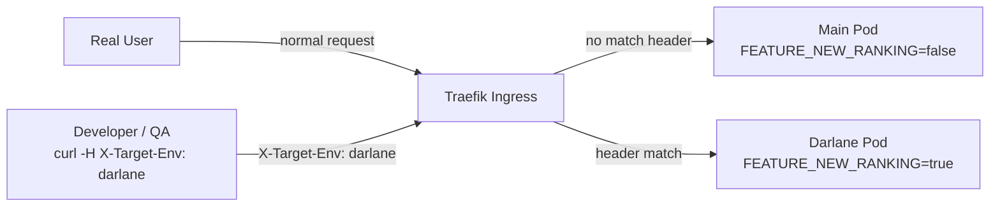

# Feature Flags with Darlane

Darlane lets you run a variant of your service — **same image, different runtime behaviour** — by injecting environment variable overrides into the debug pod only. Combined with header routing, you can target the flagged pod from specific requests without affecting any real users.

This is the simplest feature flag mechanism when you don't yet have an OpenFeature/FlagD setup, or when you want to test a flag quickly before committing it to a proper flag system.


## How It Works



The main pod runs unchanged. The Darlane pod runs with extra `env` overrides that
activate the flag. Header routing directs only your specific requests to the flagged pod.


## Setting Flag Env Vars

In the portal's **Enable Darlane** wizard, add key/value env overrides under
**Feature flags / env overrides**. These are injected only into the Darlane pod —
the main deployment is never touched.

The XTenantApp patch looks like this:

```yaml
darlane:
  enabled: true
  replicas: 1
  ttl: 4h
  env:
  - name: FEATURE_NEW_RANKING
    value: "true"
  - name: ENABLE_EXPERIMENTAL_PAYMENT
    value: "true"
  - name: LOG_LEVEL
    value: "debug"
  # trafficWeight: 0 (default) — no real user traffic, header routing only
```

The `env` list is **merged** with the main pod's environment. Existing env vars
keep their values; only the listed keys are overridden.


## Routing Requests to the Flagged Pod

With `trafficWeight: 0` (the default), the Darlane pod receives no real user
traffic. You target it explicitly via header routing:

### Enable header routing in the wizard

In the portal wizard → **Header Routing** section:
- **Header name:** `X-Target-Env` (default)
- **Header value:** `darlane` (default)

This adds to the patch:

```yaml
darlane:
  headerRouting:
    enabled: true
    header: X-Target-Env
    value: darlane
```

### Send flagged requests

```bash
# Test the flagged variant through the real ingress
curl -H "X-Target-Env: darlane" https://payment-api.dev.wxops.cloud/api/rankings

# Run your test suite against the flagged pod
BASE_URL=https://payment-api.dev.wxops.cloud \
EXTRA_HEADERS='X-Target-Env: darlane' \
pytest tests/integration/rankings/
```

Real users hit the main pod — only requests carrying the header reach the Darlane pod.


## Practical Recipes

### Testing a dark-launched feature before flag rollout

```yaml
darlane:
  enabled: true
  replicas: 1
  ttl: 8h
  env:
  - name: FEATURE_DARK_LAUNCH_V2_CHECKOUT
    value: "true"
  headerRouting:
    enabled: true
    header: X-Target-Env
    value: darlane
```

Share the header with QA: `curl -H "X-Target-Env: darlane" https://…/checkout`

### Debugging a flag that behaves differently in the cluster

```yaml
darlane:
  enabled: true
  replicas: 1
  fileSync:
    enabled: true
    mountPath: /app
  env:
  - name: FEATURE_PAYMENTS_ENABLED
    value: "true"
  - name: LOG_LEVEL
    value: "debug"
  headerRouting:
    enabled: true
    header: X-Target-Env
    value: darlane
```

Combine with `wxops darlane sync` to live-edit the code path while the flag is active.

### Testing a flag that your service reads from an env var set by a remote config

If your service reads flags from a remote config service (e.g. LaunchDarkly, Unleash),
override the SDK's bootstrap env var to force a specific flag state:

```yaml
env:
- name: LD_FLAG_NEW_RANKING
  value: "true"
- name: UNLEASH_OVERRIDE_new_ranking
  value: "enabled"
```

This works without touching the remote flag config — useful when you don't have
write access to the flag system in a shared environment.


## Darlane Feature Flags vs a Proper Flag System

Darlane env overrides are a **developer-only debug mechanism**. They are not a
replacement for a proper feature flag system.

| Capability | Darlane env overrides | OpenFeature / FlagD / LaunchDarkly |
|---|---|---|
| Target by user segment | No — header or traffic weight only | Yes — user ID, group, plan, geography |
| Gradual rollout (10% → 50% → 100%) | Approximate via `trafficWeight` (session-level) | Precise (request-level, configurable) |
| Kill switch in production | No — requires a portal change | Yes — real-time toggle, no deploy |
| Audit log of flag changes | git commit history | Flag system audit trail |
| SDK integration | No — app reads env vars | Yes — SDK evaluates flags at runtime |
| Works without Darlane | No | Yes — runs alongside the main deployment |

Use Darlane feature flags for: **local development, QA verification of a specific variant,
debugging a flag-gated code path with file sync**. Use a proper flag system for:
**production rollouts, user-segment targeting, kill switches**.

When you're ready to promote a Darlane-tested flag to a proper rollout, add it to your
flag system and remove the env override from the Darlane patch.
