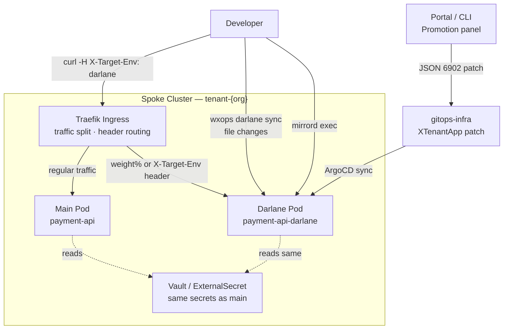

# Darlane

Darlane provisions an **on-demand parallel debug pod** alongside your running deployment — same namespace, same secrets, same environment variables — so you can develop and debug with real cluster context without touching the main deployment.

It is not a separate object. The `spec.parameters.darlane` block on your `XTenantApp` XR tells the Crossplane Composition to provision an additional Deployment alongside the main one, scoped to that environment.


## Architecture




## Overlay-Driven Configuration

Darlane config lives in the **overlay kustomization**, not the base `XTenantApp`.
This is the same pattern as ingress host, TLS issuer, and replica counts — the base
stays environment-agnostic; per-env behaviour is a JSON 6902 patch.

```
tenants-apps/{team}/{app}/
  base/
    xtenant-app.yaml            ← no darlane block here
  overlays/dev/
    kustomization.yaml          ← darlane patch added here by the portal
    patch-xtenant-app.yaml
    image-transformer.yaml
  overlays/staging/
    kustomization.yaml          ← optional; requires productionOverride: true
  overlays/production/
    kustomization.yaml          ← optional; requires productionOverride: true
```

The portal reads each overlay's `kustomization.yaml` at request time to determine
`darlaneEnabled` per environment. There is no catalog annotation — the overlay file
is the single source of truth.


## Enable Darlane

### Via the Portal

1. Open your Component's detail page
2. Open the **Promotion panel**
3. On the dev row, click **Enable Darlane**
4. Configure replicas, start command, file sync, TTL, and traffic options in the wizard
5. Click **Enable Darlane** — the portal commits the patch directly to `gitops-infra` (dev) or opens a PR (staging/production)

After ArgoCD syncs, the `{appName}-darlane` Deployment is provisioned in your namespace.

### Via the CLI

```bash
# Check status across environments
wxops darlane status payment-api

# Open an exec session (pod must already be enabled via the portal)
wxops darlane exec payment-api

# Stream file changes into the running pod
wxops darlane sync payment-api
```

The CLI is **read-only for Darlane config** — enable, reconfigure, and disable always
go through the portal. The CLI handles the runtime workflows (exec, sync) after the
pod is provisioned.


## Minimal Patch (What the Portal Writes)

```yaml
# overlays/dev/kustomization.yaml — darlane section added by portal
patches:
  - target:
      apiVersion: platform.wxops.cloud/v1alpha1
      kind: XTenantApp
      name: rocket-team-payment-api
    patch: |
      - op: add
        path: /spec/parameters/darlane
        value:
          enabled: true
          replicas: 0
          ttl: 4h
```

`replicas: 0` is the default — the pod manifest exists but is scaled to zero.
Scale it up from the portal or by setting `replicas: 1` when you need it always-on.


## Permission Model

| Environment | Who can enable / configure |
|---|---|
| `dev` | Any member of the owning team (`{org}:{team}`) |
| `staging` | `{org}:Managers` sub-group or `platform-team` |
| `production` | `{org}:Managers` sub-group or `platform-team` |

Production and staging require `productionOverride: true` in the patch — the portal
enforces this and only managers or platform-team can submit those changes.


## What Darlane Is Not

- **Not a CI/CD pipeline** — it does not build images. You sync source files and the framework hot-reloads inside the pod.
- **Not a production A/B mechanism** — `trafficWeight` is a dev debug aid. Production traffic splitting uses Argo Rollouts. See [A/B Testing](./ab-testing) for the distinction.
- **Not a replacement for your IDE** — it augments it. Darlane provides cluster context; your local editor and toolchain stay the same.
