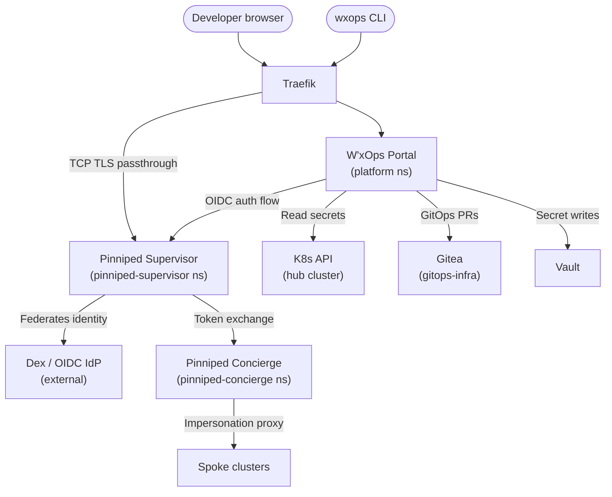

# Production Deployment

:::danger[Private distribution — not yet open source]
The W'xOps Portal container image and the supporting Helm charts are hosted on a
**private registry** and are **not publicly available**.

| Resource | Registry | Status |
|---|---|---|
| Portal container image | `gitea.xeusnguyen.xyz/platform-team/wxops-portal-v2` | Private |
| Helm charts (`pinniped`, `portal`) | `https://kubewekend.xeusnguyen.xyz` | Public |

An open-source release is planned. Until then, access is granted on a case-by-case
basis for enterprise deployments.

**To request access or schedule a demo:**
contact the platform team directly — see the footer of this page for links. Or submited ***[Enterprise Form](https://www.wxops.cloud/enterprise/)*** for quick connecting and demo.
:::

---

## Prerequisites

The following must be in place on the hub cluster before deploying the portal:

| Component | Why it's needed |
|---|---|
| **ArgoCD** | Manages all platform applications including the portal itself |
| **Traefik** (ingress controller) | TCP TLS passthrough for Pinniped; HTTP ingress for portal |
| **cert-manager** + a `ClusterIssuer` | TLS certificates for Pinniped and portal (chart uses `ca-issuer` by default) |
| **External Secrets Operator** | Syncs portal environment variables from Vault into a K8s Secret |
| **Vault** | Stores portal secrets at `secret/platform/service-portal` |
| **Dex** (or another OIDC IdP) | Upstream identity provider federated through Pinniped Supervisor |
| **Gitea** | Hosts the `gitops-infra` repo (service catalog + scaffolded overlays) |
| A private registry pull secret (`regcred`) in the `platform` namespace | Required to pull the portal image from the private Gitea registry |

---

## Architecture overview



---

## Step 1 — Deploy Pinniped

Pinniped is deployed via Helm using the private chart from `kubewekend.xeusnguyen.xyz`.
In the reference gitops setup it is managed by the `security-plane` ApplicationSet
at sync wave 2, after Vault and cert-manager are ready.

### 1a — Add the Helm repository

```bash
helm repo add kubewekend https://kubewekend.xeusnguyen.xyz
helm repo update
```

:::warning[Private repository]
This Helm repository requires credentials. Contact the platform team for access.
:::

### 1b — Configure `values.yaml`

The chart wraps both Pinniped Concierge and Supervisor under a single `pinniped:` key.
Below is the minimal production configuration for a Traefik + cert-manager cluster:

```yaml
pinniped:
  enabled: true
  installCRDs: true

  namespace:
    create: true
    name: ""           # defaults to "pinniped" → namespaces: pinniped-supervisor, pinniped-concierge

  concierge:
    enabled: true
    replicaCount: 1

    resources:
      requests: { cpu: 100m, memory: 128Mi }
      limits:   { cpu: 100m, memory: 128Mi }

    config:
      noProxy: $(KUBERNETES_SERVICE_HOST),169.254.169.254,127.0.0.1,localhost,.svc,.cluster.local

    # Impersonation proxy — ClusterIP mode (no public LoadBalancer needed)
    credentialIssuer:
      create: true
      impersonationProxy:
        mode: enabled
        externalEndpoint: "pinniped-concierge-proxy.pinniped-concierge.svc.cluster.local"
        service:
          type: ClusterIP

    # TLS via cert-manager using your existing ClusterIssuer
    tls:
      certManager:
        enabled: true
        issuerRef:
          name: ca-issuer        # ← replace with your ClusterIssuer name
          kind: ClusterIssuer
          group: cert-manager.io
        certificate:
          enabled: true
          secretName: concierge-tls-secret
          dnsNames:
            - "pinniped-concierge-proxy.pinniped-concierge.svc.cluster.local"

    # TCP TLS passthrough via Traefik
    ingress:
      enabled: true
      provider: traefik
      hostname: "pinniped-concierge-proxy.pinniped-concierge.svc.cluster.local"
      traefik:
        entryPoints: [websecure]
        tlsPassthrough: true

    # JWTAuthenticator — validates tokens issued by the Supervisor
    jwtAuthenticator:
      create: true
      name: dex-jwt-authenticator
      issuer: "https://pinniped-supervisor-clusterip.pinniped-supervisor.svc.cluster.local"
      audience: "k3s-cluster"    # ← must be unique per cluster
      certificateAuthorityDataSource:
        kind: Secret
        name: concierge-tls-secret
        key: ca.crt

  supervisor:
    enabled: true
    replicaCount: 1

    resources:
      requests: { cpu: 100m, memory: 128Mi }
      limits:   { cpu: 1000m, memory: 128Mi }

    config:
      noProxy: $(KUBERNETES_SERVICE_HOST),169.254.169.254,127.0.0.1,localhost,.svc,.cluster.local

    # TLS via cert-manager
    tls:
      certManager:
        enabled: true
        issuerRef:
          name: ca-issuer
          kind: ClusterIssuer
          group: cert-manager.io
        certificate:
          enabled: true
          secretName: supervisor-tls-secret
          dnsNames:
            - "pinniped-supervisor-clusterip.pinniped-supervisor.svc.cluster.local"

    # ClusterIP service for internal access
    service:
      public:
        clusterIP:
          enabled: true
          port: 443

    # TCP TLS passthrough via Traefik for browser OIDC flow
    ingress:
      enabled: true
      provider: traefik
      hostname: "pinniped-supervisor-clusterip.pinniped-supervisor.svc.cluster.local"
      traefik:
        entryPoints: [websecure]
        tlsPassthrough: true
        tlsSecretName: supervisor-tls-secret

    # FederationDomain — issuer URL must exactly match jwtAuthenticator.issuer
    federationDomain:
      create: true
      issuer: "https://pinniped-supervisor-clusterip.pinniped-supervisor.svc.cluster.local"
      tlsSecretName: supervisor-tls-secret

    # Identity provider — Dex (swap for github or ldap if needed)
    identityProviders:
      dex:
        create: true
        name: dex
        displayName: "Dex OIDC Authenticator"
        issuer: "https://idp.example.com"   # ← your Dex issuer URL
        additionalScopes: [offline_access, groups, email]
        usernameClaim: email
        groupsClaim: groups
        createClientSecret: true
        clientID: "pinniped-supervisor"
        clientSecret: "replace-with-real-secret"   # ← store in Vault, inject via ESO
```

### 1c — Install or sync via ArgoCD

**Direct Helm install:**

```bash
helm upgrade --install pinniped kubewekend/pinniped \
  --namespace pinniped-supervisor \
  --create-namespace \
  -f values.yaml
```

**Via ArgoCD Application (recommended):**

```yaml
apiVersion: argoproj.io/v1alpha1
kind: Application
metadata:
  name: security-pinniped
  namespace: argocd
  annotations:
    argocd.argoproj.io/sync-wave: "2"
spec:
  project: infrastructure
  source:
    repoURL: https://gitea.example.com/platform-team/gitops-infra.git
    targetRevision: main
    path: base/security-plane/pinniped
    helm:
      releaseName: pinniped
      valueFiles: [values.yaml]
  destination:
    server: https://kubernetes.default.svc
    namespace: pinniped-supervisor
  syncPolicy:
    automated: { prune: true, selfHeal: true }
    syncOptions: [CreateNamespace=true]
```

### 1d — Register the portal as an OIDCClient

:::warning
The `OIDCClient` CR name **must** start with `client.oauth.pinniped.dev-`.
:::

```yaml
apiVersion: config.supervisor.pinniped.dev/v1alpha1
kind: OIDCClient
metadata:
  name: client.oauth.pinniped.dev-wxops-portal
  namespace: pinniped-supervisor
spec:
  allowedRedirectURIs:
    - https://portal.example.com/auth/callback
  allowedGrantTypes:
    - authorization_code
    - refresh_token
    - urn:ietf:params:oauth:grant-type:token-exchange
  allowedScopes:
    - openid
    - offline_access
    - username
    - groups
    - pinniped:request-audience
```

### 1e — Generate the client secret

:::warning
Pinniped stores only a bcrypt hash — the plaintext is returned **once**. Copy it immediately into Vault.
:::

```bash
cat <<EOF | kubectl create -o yaml -f -
apiVersion: clientsecret.supervisor.pinniped.dev/v1alpha1
kind: OIDCClientSecretRequest
metadata:
  name: client.oauth.pinniped.dev-wxops-portal
  namespace: pinniped-supervisor
spec:
  generateNewSecret: true
EOF
```

Store the `status.generatedSecret` value in Vault under the portal's secret path before proceeding.

**Emergency rotation** (revokes all previous secrets):

```bash
cat <<EOF | kubectl create -o yaml -f -
apiVersion: clientsecret.supervisor.pinniped.dev/v1alpha1
kind: OIDCClientSecretRequest
metadata:
  name: client.oauth.pinniped.dev-wxops-portal
  namespace: pinniped-supervisor
spec:
  generateNewSecret: true
  revokeOldSecrets: true
EOF
```

---

## Step 2 — Store portal secrets in Vault

The portal's environment variables are injected from a Kubernetes Secret that
External Secrets Operator syncs from Vault. Create the KV entry at
`secret/platform/service-portal` (adjust the mount path to match your `VAULT_KV_MOUNT`):

```bash
vault kv put secret/platform/service-portal \
  SESSION_SECRET="$(openssl rand -hex 32)" \
  OIDC_ISSUER_URL="https://pinniped-supervisor-clusterip.pinniped-supervisor.svc.cluster.local" \
  OIDC_CLIENT_ID="client.oauth.pinniped.dev-wxops-portal" \
  OIDC_CLIENT_SECRET="<paste generatedSecret from step 1e>" \
  OIDC_REDIRECT_URI="https://portal.example.com/auth/callback" \
  GITEA_URL="https://gitea.example.com" \
  GITEA_TOKEN="<gitea-service-account-token>" \
  GITEA_CATALOG_OWNER="platform-team" \
  GITEA_CATALOG_REPO="gitops-infra" \
  VAULT_ADDR="https://vault.example.com" \
  VAULT_TOKEN="<vault-portal-policy-token>" \
  WEBHOOK_TOKEN="$(openssl rand -hex 24)"
```

See [Environment Variables](./environment-variables) for the full reference of every key.

The ExternalSecret that syncs this path is included in the portal Helm chart templates:

```yaml
apiVersion: external-secrets.io/v1
kind: ExternalSecret
metadata:
  name: platform-service-portal-env
  namespace: platform
spec:
  refreshInterval: 1m
  secretStoreRef:
    name: vault-platform       # ClusterSecretStore pointing to your Vault
    kind: ClusterSecretStore
  target:
    name: platform-service-portal-env
  dataFrom:
    - extract:
        key: service-portal    # → secret/platform/service-portal
```

---

## Step 3 — Deploy the portal

The portal uses a `common` Helm chart dependency from `kubewekend.xeusnguyen.xyz`.

### 3a — Create the `Chart.yaml`

```yaml
apiVersion: v2
name: service-portal
version: 1.0.0
dependencies:
  - name: common
    version: 0.3.2
    repository: https://kubewekend.xeusnguyen.xyz
    alias: portal
    condition: portal.enabled
```

### 3b — Configure `values.yaml`

```yaml
portal:
  enabled: true
  fullnameOverride: wxops-service-portal

  image:
    repository: gitea.xeusnguyen.xyz/platform-team/wxops-portal-v2
    tag: latest                 # ← pin to a specific release tag in production
    pullPolicy: Always
  imagePullSecrets:
    - name: regcred             # ← pull secret for the private Gitea registry

  service:
    type: ClusterIP
    port: 80

  ingress:
    enabled: true
    className: traefik
    annotations:
      cert-manager.io/cluster-issuer: "ca-issuer"
    hosts:
      - host: portal.example.com
        paths:
          - path: /
            pathType: ImplementationSpecific
    tls:
      - secretName: service-portal-tls
        hosts:
          - portal.example.com

  # Environment variables pulled from the Vault-synced Secret
  envFrom:
    - secretRef:
        name: platform-service-portal-env

  # FRONTEND_URL is safe to set as a plain env var (not a secret)
  env:
    FRONTEND_URL: "https://portal.example.com"

  resources:
    requests:
      memory: 256Mi
      cpu: 50m
    limits:
      memory: 512Mi

  probes:
    port: http
    disableProbes: [startupProbe]
    livenessProbe:
      httpGet:
        path: /healthz
    readinessProbe:
      httpGet:
        path: /readyz

  # Role + RoleBinding: read Secrets in the portal namespace for cluster discovery
  rbac:
    create: true
    role:
      kind: Role
      rules:
        - apiGroups: [""]
          resources: ["secrets"]
          verbs: ["get", "list", "watch"]
    roleBinding:
      roleRef:
        apiGroup: rbac.authorization.k8s.io
        kind: Role
      subjects:
        - kind: ServiceAccount
          name: wxops-service-portal

  serviceAccount:
    create: true
    name: wxops-service-portal
```

### 3c — Sync via ArgoCD Application

```yaml
apiVersion: argoproj.io/v1alpha1
kind: Application
metadata:
  name: platform-service-portal
  namespace: argocd
spec:
  project: infrastructure
  source:
    repoURL: https://gitea.example.com/platform-team/gitops-infra.git
    targetRevision: main
    path: platform/service-portal
    helm:
      releaseName: platform-service-portal
      valueFiles: [values.yaml]
  destination:
    server: https://kubernetes.default.svc
    namespace: platform
  syncPolicy:
    syncOptions: [CreateNamespace=true]
```

---

## Step 4 — Register spoke clusters

Each spoke cluster requires:

1. **Pinniped Concierge** installed with a `JWTAuthenticator` pointing to the hub Supervisor
2. **Tenant RBAC** so Pinniped-issued tokens can list pods/deployments in tenant namespaces
3. A **cluster registration Secret** in the hub's `wxops-system` namespace

### 4a — JWTAuthenticator on each spoke

```yaml
apiVersion: authentication.concierge.pinniped.dev/v1alpha1
kind: JWTAuthenticator
metadata:
  name: wxops-jwt-authenticator
spec:
  issuer: https://pinniped-supervisor-clusterip.pinniped-supervisor.svc.cluster.local
  audience: prod-east              # must be unique per cluster
  tls:
    certificateAuthorityData: <base64-encoded Supervisor CA PEM>
```

### 4b — Tenant RBAC on each spoke

```yaml
apiVersion: rbac.authorization.k8s.io/v1
kind: ClusterRole
metadata:
  name: wxops-portal-tenant-viewer
rules:
- apiGroups: [""]
  resources: ["pods", "services", "resourcequotas"]
  verbs: ["get", "list"]
- apiGroups: ["apps"]
  resources: ["deployments"]
  verbs: ["get", "list"]
---
apiVersion: rbac.authorization.k8s.io/v1
kind: RoleBinding
metadata:
  name: wxops-portal-viewer
  namespace: tenant-<org>
subjects:
- kind: Group
  name: <org>:rocket-team        # Gitea OIDC group in org:team format
  apiGroup: rbac.authorization.k8s.io
roleRef:
  kind: ClusterRole
  name: wxops-portal-tenant-viewer
  apiGroup: rbac.authorization.k8s.io
```

See [Permissions](/docs/security/permissions) for the full RBAC matrix.

### 4c — Cluster registration Secret on the hub

Create one Secret per spoke in the hub cluster's `wxops-system` namespace:

```yaml
apiVersion: v1
kind: Secret
metadata:
  name: cluster-prod-east
  namespace: wxops-system
  labels:
    wxops.cloud/kind: cluster
  annotations:
    wxops.cloud/cluster-id:                  prod-east
    wxops.cloud/cluster-name:                "Production East"
    wxops.cloud/jwt-authenticator-audience:  prod-east
    wxops.cloud/jwt-authenticator-name:      wxops-jwt-authenticator
    wxops.cloud/issuer-url:                  https://pinniped-supervisor-clusterip.pinniped-supervisor.svc.cluster.local
    wxops.cloud/upstream-idp-name:           "Dex OIDC Authenticator"
    wxops.cloud/upstream-idp-type:           oidc
stringData:
  api-server: "https://api.prod-east.example.com:6443"
  ca-bundle: |
    -----BEGIN CERTIFICATE-----
    <spoke cluster CA PEM>
    -----END CERTIFICATE-----
```

---

## Step 5 — Supervisor TLS CA

| Supervisor certificate | Action |
|---|---|
| Let's Encrypt / public CA | Nothing — system root pool is used automatically |
| Internal / private CA | Set `OIDC_CA_BUNDLE` or `OIDC_CA_BUNDLE_FILE` on the portal |
| Self-signed (dev only) | Set `OIDC_TLS_SKIP_VERIFY=true` — kubeconfig downloads will not work |

---

## Verification

After all steps complete:

```bash
# Portal pod should be Running
kubectl get pods -n platform -l app.kubernetes.io/name=wxops-service-portal

# Pinniped Supervisor FederationDomain should be Ready
kubectl get federationdomain -n pinniped-supervisor

# OIDCClient should be Ready
kubectl get oidcclient client.oauth.pinniped.dev-wxops-portal \
  -n pinniped-supervisor \
  -o jsonpath='{.status.conditions}' | jq .

# Portal health endpoints
curl -sk https://portal.example.com/healthz
curl -sk https://portal.example.com/readyz
```

Open `https://portal.example.com` — you should be redirected to the Pinniped / Dex login flow.

---

## Next steps

- [Environment Variables](./environment-variables) — full reference for every backend and frontend variable
- [Architecture](/docs/concepts/architecture) — auth model, hub-spoke topology, security boundaries
- [Security & Permissions](/docs/security/permissions) — RBAC matrix for platform and tenant roles
