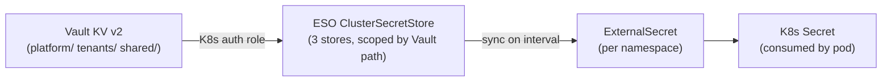

# GitOps Infrastructure

`wxops-gitops-infrastructure` is the **single source of truth** for every Kubernetes
resource on every cluster. One `kubectl apply -f app-of-apps.yaml` seeds ArgoCD;
from that point on every change — new platform tool, new tenant, new workload — is a
Git commit.

No manual cluster operations after bootstrap.

## App-of-Apps: Planes Pattern

Instead of one file per application, the repo uses **one `ApplicationSet` per
functional plane**. Adding a service to an existing plane = one list entry. Adding a
new plane = one new ApplicationSet.

### Sync Wave Order

| Wave | Plane | What it manages |
|---|---|---|
| 1 | `ingress-plane` | Traefik, external-dns, traefik-configs |
| 1 | `policy-plane` | Kyverno ClusterPolicies |
| 2 | `security-plane` | Vault, oauth2-proxy, Pinniped |
| 2 | `orchestration-plane` | ArgoCD (self-managed), Crossplane runtime, act-runner |
| 2 | `platform-configs` | cert-manager, ESO, cluster secrets, ArgoCD Image Updater, RBAC, users |
| 3 | `observability-plane` | Grafana Alloy, kube-prometheus-stack, Loki, Tempo, Pyroscope |
| 3 | `data-plane` | SeaweedFS, CloudNativePG, SchemaHero |
| 4 | `tenants` | Namespace, RBAC, Vault identity, Gitea orgs per tenant |
| 5 | `tenants-apps` | Tenant workloads (dev: auto-sync; staging/prod: manual gate) |

Wave ordering guarantees Traefik exists before Vault, Vault before tenant namespaces,
namespaces before workloads.

### Adding a New Platform Tool

For planes that use the **git-directory ApplicationSet generator** (observability,
data), adding a new tool is automatic:

```
base/observability-plane/<new-tool>/
  Chart.yaml         # or kustomization.yaml
  values.yaml
```

ArgoCD discovers the directory and creates an Application automatically.

For **list-based planes** (ingress, security, orchestration), append an entry to the
plane's ApplicationSet YAML.

## Tenant Provisioning

Each tenant maps to one directory in `tenants/<team>/`. The `tenants` ApplicationSet
(wave 4) discovers all directories here and creates one ArgoCD Application per team.

### Required Files per Tenant

| File | What it creates |
|---|---|
| `namespace.yaml` | `Namespace` with `wxops.cloud/tenant` + `wxops.cloud/portal: "true"` labels |
| `rbac.yaml` | Three `RoleBinding` objects: Managers → `tenant-manager`, Developers → `tenant-developer`, Viewers → `tenant-viewer` |
| `vault-identity.yaml` | Vault `Policy` (read `tenants/<team>/*` + `shared/*`) and K8s auth `AuthBackendRole` |
| `gitea-org-members.yaml` | `XGiteaOrg` + `XGiteaTeam` claims — provisions Gitea organisation and team membership |
| `argo-project.yaml` | ArgoCD `AppProject` scoped to the tenant namespace |
| `image-updater.yaml` | ArgoCD Image Updater CR watching the tenant's apps |
| _(optional)_ `resource-quota.yaml` | Override default quotas for large teams |

The `wxops.cloud/tenant` label on the namespace triggers three Kyverno
`GeneratingPolicy` objects that auto-provision into the namespace:

| Policy | Creates |
|---|---|
| `network-policies` | Default-deny ingress (allow Traefik + same-namespace) + allow all in-cluster egress |
| `resource-quota` | `ResourceQuota` (2CPU/4Gi req, 4CPU/8Gi limit, 20 pods) + `LimitRange` (100m/128Mi defaults) |
| `sync-secrets` | Clones the `regcred` image pull Secret from `kube-system` |

## RBAC Personas

| ClusterRole | Who gets it | Access scope |
|---|---|---|
| `tenant-developer` | `{org}:Developers` sub-group | CRUD workloads + XRDs; read secrets + ExternalSecrets |
| `tenant-manager` | `{org}:Managers` sub-group | Full workload control + ingress/HPA/PDB/PVCs; no RBAC management |
| `tenant-viewer` | `{org}:Viewers` sub-group | Read-only across all tenant resources |
| `platform-oncall` | Platform team on-call | Read cluster-wide; exec/port-forward; patch deployments |
| `platform-cluster-admin` | Platform team break-glass | Full cluster-admin via ClusterRoleBinding |

Bindings use the full `orgName:teamName` string as the subject — matching exactly what
Pinniped relays from Gitea OIDC groups.

## Secret Management Architecture



Three `ClusterSecretStore` objects, each backed by a dedicated Vault K8s auth role:

| Store | Vault mount | Used by |
|---|---|---|
| `vault-platform` | `platform/` | Platform team infrastructure secrets |
| `vault-tenant` | `tenants/` | Tenant app secrets, scoped per team by policy |
| `vault-shared` | `shared/` | Cross-team shared secrets (image pull credentials, etc.) |

Vault infrastructure — mounts, OIDC auth, K8s auth, policies, roles — is fully
GitOps-managed via Crossplane `provider-vault` CRDs under `platform/vault/`.
Secret **values** are never in Git — only `ExternalSecret` references.

### Vault Path Conventions

| Path pattern | Content |
|---|---|
| `platform/database-clusters/{clusterName}/…` | Platform CNPG cluster credentials |
| `tenants/{team}/{appName}/env` | App environment variables (synced to `{appName}-env` Secret) |
| `tenants/{team}/databases/{appName}-db/connection-creds` | DB credentials (synced to `{appName}-db-creds` Secret) |
| `shared/{name}` | Cross-team shared secrets |

## How the Portal Writes Here

When a developer scaffolds a new app through the portal:

1. Portal commits `tenants-apps/<team>/<app>/base/` (XTenantApp, XTenantDatabase,
   ExternalSecrets, catalog entities) and `overlays/dev/` (image transformer + dev patch)
2. The `tenants-apps` ApplicationSet (wave 5) auto-discovers the new `overlays/dev/`
   directory and creates an ArgoCD Application with **auto-sync + prune + selfHeal**
3. ArgoCD syncs to the dev spoke cluster; Crossplane expands the `XTenantApp` XR

`overlays/staging/` and `overlays/production/` are gated behind **manual sync** in
ArgoCD — the portal creates them via PR, but ArgoCD will not apply them until a
platform team member (or manager) clicks Sync or merges the Confirm step.

:::info[Portal-generated directories]
`tenants-apps/<team>/<app>/` directories are marked `portal-managed` via Gitea label.
Do not edit them manually — the portal's next scaffold or promote action may overwrite changes.
:::

## CI in This Repo

| Workflow | Trigger | Action |
|---|---|---|
| `catalog-cache-refresh` | Push touching `service-catalog/` | POSTs to `PORTAL_URL/api/v1/webhooks/catalog/refresh` to invalidate portal cache |
| `cve-scan` | Schedule + push | Trivy scan; opens auto-PR on CRITICAL findings |
| `renovate` | Schedule | Automated dependency updates |
