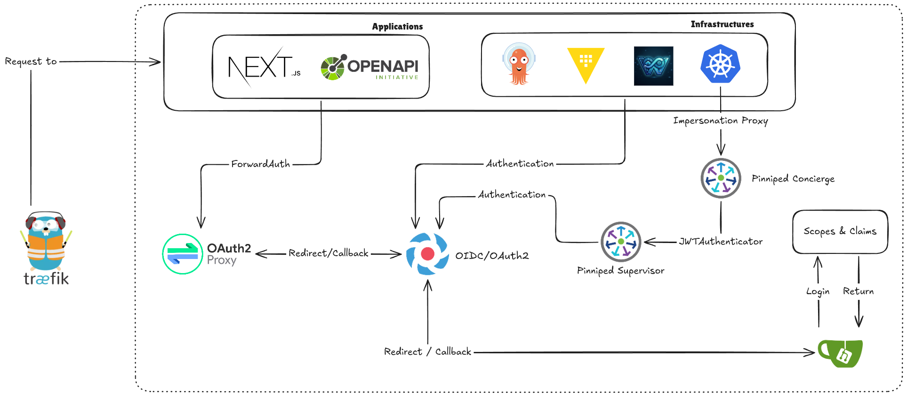

# OAuth & Identity

W'xOps uses a three-layer identity stack: **Dex** as the OIDC identity broker, **Pinniped Supervisor** as the Kubernetes-native SSO layer, and **OAuth2/PKCE** as the portal's own session mechanism. A single login gives the user access to the portal UI, the `wxops` CLI, and every registered spoke cluster — without sharing long-lived credentials.

## Components

### Dex IDP

[Dex](https://dexidp.io) is an OpenID Connect identity provider that federates upstream identity sources — Gitea OAuth2, LDAP, GitHub, SAML — into a single OIDC endpoint consumed by Pinniped.

### Pinniped Supervisor

[Pinniped Supervisor](https://pinniped.dev) is a Kubernetes-native OIDC server. It issues short-lived, cluster-scoped tokens that Concierge validates on each spoke cluster. Key CRs:

| CR | Purpose |
|---|---|
| `FederationDomain` | OIDC issuer endpoint; maps upstream IDPs to display names |
| `OIDCIdentityProvider` | Connects Supervisor to Dex (or any OIDC upstream) |
| `JWTAuthenticator` | Installed on each spoke; validates Supervisor-issued tokens |

### OAuth2 / PKCE in the Portal

The portal's Go backend implements an OAuth2 Authorization Code flow with PKCE against Pinniped Supervisor. No client secret is stored — the PKCE `code_verifier` is sufficient for public clients.

## Login Flow

:::info
Full sequence diagram and login flow details to be added.
:::

## Gitea as the Upstream Identity Provider

:::info
Gitea OAuth2 app setup, group claims, and Dex connector config to be added.
:::

## Group Claims and RBAC

Gitea sends group membership claims in the format `orgName:teamName` (e.g. `wxops:rocket-team`). Pinniped passes these through as Kubernetes `groups` in the impersonation request.

The portal uses group membership to:
- Derive the user's tenant namespace (`tenant-{orgName}`)
- Gate lifecycle promotion (only `platform-team` or `{team}:Managers` can promote to staging/production)
- Scope cluster tab queries — never calling `GET /api/v1/namespaces` for tenant users

## Configuration Reference

:::info
Environment variables for OIDC client ID, issuer URL, and redirect URI to be added.
:::

## CLI Authentication

The `wxops login` command triggers the same PKCE flow as the browser. After completion the token is stored in `~/.config/wxops/token` and used for all subsequent CLI commands.
