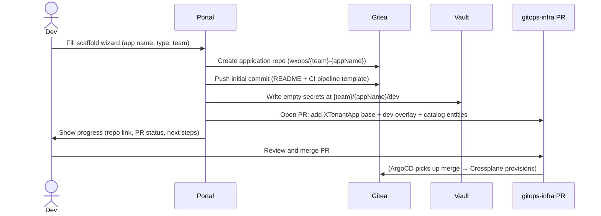

# Golden-Path Scaffolding

The Scaffold wizard creates everything a new service needs in one flow —
no platform ticket, no YAML hand-editing.


## What Gets Created



After the PR is merged:
- ArgoCD syncs the new overlay
- Crossplane creates the `XTenantApp` and `XTenantDatabase` CRs
- The app is alive in the `dev` environment


## Scaffold Wizard Steps

| Step | Fields | Notes |
|---|---|---|
| 1 — App details | App name, description, team | App name is slugified to lowercase-hyphen |
| 2 — Template | Template selector | Shows templates from `scaffold-templates` repo |
| 3 — Features | Database, external secrets, ingress | Feature toggles |
| 4 — Preview | YAML preview | Live render of all generated manifests |
| 5 — Create | Confirm | Runs the creation flow |

Scaffold wizard is a **feature toggles + extensions** wizard. Fields like DB
name, tier, cluster assignment, ingress host, and resource limits go into
the separate Promote overlay wizard when advancing lifecycle stages.


## Generated Directory Structure

```
tenants-apps/{team}/{appName}/
├── base/
│   ├── kustomization.yaml          ← lists all base resources
│   ├── xtenant-app.yaml            ← identity, image, wiring (env-agnostic)
│   ├── xtenant-database.yaml       ← (if database enabled)
│   ├── external-secret-app.yaml    ← (if secrets enabled)
│   └── catalog-component.yaml      ← catalog entity
└── overlays/
    └── dev/
        ├── kustomization.yaml      ← references ../../base
        ├── image-transformer.yaml  ← teaches Kustomize where spec/parameters/image is
        └── patch-xtenant-app.yaml  ← env-specific: replicas, resources, ingress, secretsFrom

tenants/{team}/
└── {appName}-image-updater.yaml   ← ArgoCD Image Updater CR (NOT inside tenants-apps/)
```


## Why `image-transformer.yaml` Exists

Kustomize's built-in image substitution only knows the standard `Deployment` /
`StatefulSet` container image path out of the box. `XTenantApp` is a Crossplane XR —
its image lives at the non-standard path `spec/parameters/image`. `image-transformer.yaml`
teaches Kustomize that path, referenced from each overlay's `kustomization.yaml` via
`configurations:` (the legacy per-transformer fieldSpecs file, not a standalone
`transformers:` resource):

```yaml
images:
  - path: spec/parameters/image
    kind: XTenantApp
```

That's the entire file — one `fieldSpecs`-shaped entry, nothing else. See the
[`ImageTagTransformer` reference](https://kubectl.docs.kubernetes.io/references/kustomize/builtins/#_imagetagtransformer_)
for how Kustomize's built-in image transformer and its `fieldSpecs` mechanism work in
general, and Kustomize's own
[`transformerconfigs/images` example](https://github.com/kubernetes-sigs/kustomize/blob/master/examples/transformerconfigs/images/README.md)
for why a separate `configurations:` file is the documented way to extend image
substitution onto a custom resource path, rather than hand-rolling one.


## Why `images:` Is NOT in the Overlay `kustomization.yaml`

ArgoCD Image Updater writes the `images:` section back after every CI build.
If you add a static `images:` block, the Image Updater's write sets it to
`latest` on every reconcile, overwriting your pin. Leave that section empty —
the Image Updater owns it.


## ArgoCD Image Updater CR

Location: `tenants/{team}/{appName}-image-updater.yaml` (not in `tenants-apps/`). Uses
the [ArgoCD Image Updater v1.x `ImageUpdater`](https://argocd-image-updater.readthedocs.io/)
CRD — one CR per application, one `applicationRefs` entry per environment, each with its
own update strategy:

```yaml
apiVersion: argocd-image-updater.argoproj.io/v1alpha1
kind: ImageUpdater
metadata:
  name: {team}-{appName}
  labels:
    app.kubernetes.io/managed-by: wxops-portal
    wxops.cloud/app: {appName}
    wxops.cloud/team: {team}
spec:
  namespace: argocd
  writeBackConfig:
    method: git:secret:argocd/git-creds
    gitConfig:
      branch: main
      repository: https://gitea.example.com/platform-team/wxops-gitops-infrastructure.git
  applicationRefs:
    - namePattern: {team}-{appName}-dev
      commonUpdateSettings:
        updateStrategy: newest-build
        pullSecret: pullsecret:argocd/regcred
        forceUpdate: true
        allowTags: regexp:^dev-.*$
        ignoreTags:
          - latest
          - cache
      images:
        - alias: application
          imageName: gitea.example.com/{team}/{appName}
          manifestTargets:
            kustomize:
              name: gitea.example.com/{team}/{appName}
    - namePattern: {team}-{appName}-staging
      commonUpdateSettings:
        updateStrategy: newest-build
        pullSecret: pullsecret:argocd/regcred
        forceUpdate: true
        allowTags: regexp:^v?(?:0\.[1-9]\d*|[1-9]\d*\.\d+)\.\d+-rc\d+$
        ignoreTags:
          - latest
          - cache
      images:
        - alias: application
          imageName: gitea.example.com/{team}/{appName}
          manifestTargets:
            kustomize:
              name: gitea.example.com/{team}/{appName}
    - namePattern: {team}-{appName}-production
      commonUpdateSettings:
        updateStrategy: semver
        pullSecret: pullsecret:argocd/regcred
        forceUpdate: true
        ignoreTags:
          - latest
          - cache
      images:
        - alias: application
          imageName: gitea.example.com/{team}/{appName}
          manifestTargets:
            kustomize:
              name: gitea.example.com/{team}/{appName}
```

`writeBackConfig` is what lets Image Updater commit the resolved tag straight back into
the overlay's `kustomization.yaml` `images:` block (see above) instead of just updating
the live Argo CD `Application` in place.

### Image tag conventions

| Environment | Tag format | `updateStrategy` | How the tag is produced |
|---|---|---|---|
| dev | `dev-{YYYY-MM-DD_HH-MM-SS}-{sha7}` | `newest-build`, `allowTags` regexp matching `dev-*` | CI build on `develop` |
| staging | `vX.Y.Z-rcN` | `newest-build`, `allowTags` regexp matching the `-rcN` pre-release shape | crane re-tag on staging merge |
| production | `vX.Y.Z` | `semver` | crane re-tag on production release |

`ignoreTags: [latest, cache]` is set on every environment — neither is a real release
artifact, so Image Updater should never treat either as a candidate.


## Scaffold Templates

Templates live in the [`wxops-templates`](https://github.com/wxops/wxops-templates)
repository — one directory per language (`golang-service/`, `nodejs-service/`,
`python-service/`), each a complete, self-contained service. The portal reads each
template's `template.yaml` directly via the Gitea API (or from a local directory in dev) —
no separate registration step, no config change needed to add one.

This is the real, current shape of a `template.yaml`:

```yaml
name: golang-service
title: Go Service
description: >
  Production-ready Go service with structured logging,
  health checks, and Prometheus metrics endpoint.
tags:
  - backend
  - go
  - microservice

runtime:
  language: go
  version:
    default: "1.26"
    options: ["1.26", "1.25", "1.24", "1.23"]

defaults:
  port: 8080
  replicas: 1
  cpuRequest: 100m
  memoryRequest: 128Mi
  cpuLimit: 200m
  memoryLimit: 256Mi
  healthPath: /healthz
  metricsPath: /metrics

recommends:
  vault: true
  database: false
  api: false
  apiType: openapi
  ingress: true
  monitoring: true
```

Platform teams add templates by pushing a new directory to `wxops-templates`, each with its
own `template.yaml` in this shape.

:::caution[Experimental design, never implemented]
Earlier drafts of this page (carried through from the v0.4.x docs) showed a different
example here — a `kind: Template` custom resource reconciled by an operator, with
`spec.defaults` and a conditional `spec.recommends[].when` rule list. That was an early,
experimental design. **It was never built and doesn't reflect how templates actually work.**
There is no CRD, no operator, and no conditional-rule engine — templates are plain YAML
files read directly from `wxops-templates`, in the shape shown above. See
[Direction: Fleet Sync & Flexible Delivery](./fleet-sync-and-flexible-delivery) for where
templates are actually headed next.
:::
