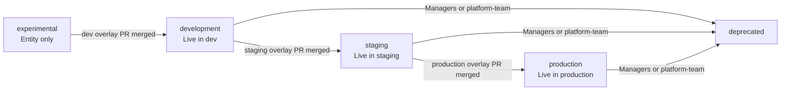

# Environment Promotion

Every service scaffolded by W'xOps starts as a catalog entry with no deployment. Promotion is the
act of committing environment config to `gitops-infra` — ArgoCD picks it up, Crossplane provisions
infrastructure, and the lifecycle advances.



| Transition | Who can trigger |
|---|---|
| experimental → development | Any team member |
| development → staging | Managers or platform-team only |
| staging → production | Managers or platform-team only |
| Any → deprecated | Managers or platform-team only |


## Gitops Layout

Scaffold generates `base/` manifests only. **No overlay is created at scaffold time.**
Overlays are written by the portal when you use the Promotion panel.

```
gitops-infra/
  tenants-apps/<team>/<app>/
    base/
      kustomization.yaml
      xtenant-app.yaml
      xtenant-database.yaml          # if database enabled
      external-secret-env.yaml
      external-secret-db.yaml        # if database enabled
    overlays/
      dev/                           # created: experimental → development
        kustomization.yaml           # references ../../base
        image-transformer.yaml       # teaches Kustomize to patch XTenantApp image field
        patch-xtenant-app.yaml       # dev-specific patches
      staging/                       # created: development → staging
        kustomization.yaml
        patch-xtenant-app.yaml
      production/                    # created: staging → production
        kustomization.yaml
        patch-xtenant-app.yaml
  tenants/<team>/
    <app>-image-updater.yaml         # ArgoCD Image Updater CR (lives outside tenants-apps/)
```

ArgoCD ApplicationSet uses a directory generator matching `tenants-apps/*/*/overlays/*`.
Each overlay directory produces one Application named `{team}-{appName}-{env}`.


## What Changes Per Environment

The overlay patches target a well-known set of fields on the `XTenantApp` CR:

| Field | Dev | Staging | Production |
|---|---|---|---|
| `replicas` | 1 | 2 | 3+ |
| `resources.cpu.request` | 50m | 100m | 250m+ |
| `resources.memory.request` | 64Mi | 128Mi | 256Mi+ |
| `ingress.host` | `app.dev.example.com` | `app.staging.example.com` | `app.example.com` |
| Vault secret path | `{team}/{app}/dev/env` | `{team}/{app}/staging/env` | `{team}/{app}/production/env` |
| Image tag pattern | `dev-*` | `vX.Y.Z-rcN` | `vX.Y.Z` |
| Rollout strategy | RollingUpdate | RollingUpdate | BlueGreen (optional) |

The base manifest (`base/xtenant-app.yaml`) holds env-agnostic identity and dev-like defaults.
Each overlay only patches what differs — fields absent from the patch inherit from base.

### Example base manifest

```yaml
apiVersion: platform.wxops.cloud/v1alpha1
kind: XTenantApp
metadata:
  name: finops-payment-api
spec:
  parameters:
    appName: payment-api
    owner: finops
    namespace: tenant-finops
    containerPort: 8080
    replicas: 1
    image:
      repository: gitea.example.com/finops/payment-api
      tag: latest          # Image Updater takes over after first build
    resources:
      cpu: { request: "50m", limit: "200m" }
      memory: { request: "64Mi", limit: "256Mi" }
    ingress:
      enabled: true
      host: payment-api.dev.example.com
```

### Example production overlay patch

```yaml
# overlays/production/patch-xtenant-app.yaml
- op: replace
  path: /spec/parameters/replicas
  value: 3
- op: replace
  path: /spec/parameters/resources/cpu/request
  value: "250m"
- op: replace
  path: /spec/parameters/resources/memory/request
  value: "256Mi"
- op: replace
  path: /spec/parameters/ingress/host
  value: payment-api.example.com
```

The ExternalSecret in the overlay similarly patches `spec.dataFrom[0].extract.key` to point
to the production Vault path — no separate secret files needed per environment.


## Why Kustomize, Not Helm

The portal must **read** per-environment config from git without running any rendering engine.
That constraint decides the tool.

### The core problem with Helm

Helm templates embed Go template syntax (`{{ .Values.replicas }}`) inside manifest files.
To see what a Helm release will produce for a given environment, you must run `helm template`
with the right values file. The portal backend would need to shell out to Helm, handle version
compatibility, and parse the rendered output — all to answer "what replicas does staging use?"

Kustomize patches are plain JSON 6902 operations on plain YAML. The portal reads them directly:

```go
// Reading a Kustomize patch — no rendering engine needed
patch := kustomization.Patches[0]
// patch.Path = "/spec/parameters/replicas"
// patch.Value = 3
```

### The comparison

| Concern | Kustomize | Helm |
|---|---|---|
| Portal reads env config | Parse patch ops directly — no renderer needed | Must run `helm template` or parse `values-*.yaml` |
| What the portal sees | JSON patch ops against a known base | Flat key-value (values files) or rendered YAML |
| Template syntax in manifests | None — manifests are plain YAML | Go templates throughout |
| Image tag management | `image-transformer.yaml` + ArgoCD Image Updater | `{{ .Values.image.tag }}` in templates |
| Adding a new env field | Add a `op: replace` patch | Add `{{ .Values.newField }}` to template + values |
| Debugging locally | `kustomize build overlays/production/` | `helm template . -f values-production.yaml` |
| ArgoCD native support | Yes | Yes |
| Portal read complexity | **Low** — YAML is YAML | **High** — requires rendering before parsing |

### Why not Helm values files?

You could separate the portal-readable data into `values-staging.yaml` / `values-production.yaml`
and keep templates only in `templates/`. The values files would be flat YAML — easy to parse.

The problem is the template files themselves. Fields like `metadata.name`, `spec.dataFrom`, and
`spec.target.name` all need per-environment substitution. In Helm that means Go template syntax
in every manifest. When the Composition team changes a field path in the XTenantApp CRD, every
template file needs updating — and the portal would need to test-render to catch breakage.

Kustomize keeps manifests clean. The CRD schema is the template. Patches are additive.
When the Composition team adds a new field, existing overlays continue to work — they just don't
patch the new field until explicitly needed.

### The `image-transformer.yaml` exception

Kustomize natively substitutes images only in standard Deployment/StatefulSet manifests.
`XTenantApp` is a CRD — Kustomize doesn't know its schema. `image-transformer.yaml` teaches
Kustomize where the image field lives:

```yaml
# overlays/dev/image-transformer.yaml
apiVersion: builtin
kind: ImageTagTransformer
metadata:
  name: image-transformer
imageTag:
  name: payment-api
fieldSpecs:
  - path: spec/parameters/image/tag
    kind: XTenantApp
```

ArgoCD Image Updater writes back the resolved tag into the overlay's `kustomization.yaml`
under the `images:` block — which is why **the portal never writes a static `images:` block**.
Image Updater owns that section; a static value would be overwritten on every reconcile,
resetting the tag to `latest`.


## Two-Step Promotion Flow

The Promotion panel on every Component detail page drives promotion:

**Step 1 — Create overlay PR**
1. Click "Create overlay" for the target environment
2. Configure environment-specific values (replicas, ingress host, resource limits, Vault secrets)
3. Portal commits the overlay files to `gitops-infra` and opens a PR titled `[Promote] {team}/{app} → {env}`
4. Platform-team reviews and merges

**Step 2 — Confirm lifecycle**
1. Panel polls for the overlay on `main` — shows "Confirm" when it detects the merge
2. One click: portal updates the catalog entity lifecycle field
3. ArgoCD ApplicationSet discovers the new overlay directory and creates the Application

If a promotion PR is already open, the row shows "PR #N pending" — preventing duplicate PRs.

:::info
Dev overlays (`experimental → development`) are committed directly to `main`.
Staging and production overlays always open a PR for platform-team review.
:::
