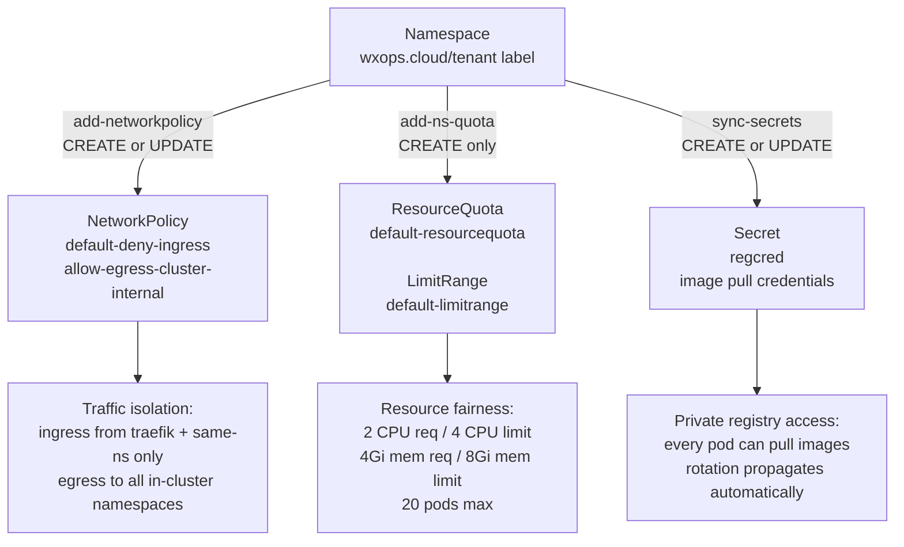

# Kyverno — Policy as Code

Policies in W'xOps are Kubernetes manifests stored in `policies/` inside
`wxops-gitops-infrastructure`, deployed by the `policy-plane` ApplicationSet
at sync wave 1 — before any workload lands on the cluster. There are no
hand-applied `kubectl` commands: every rule has a commit, every change is
reviewable, every rollback is a revert.

The core purpose is consistent multi-tenancy: **every tenant namespace should
behave the same way without each tenant having to configure anything**. Network
isolation, resource fairness, and image pull credentials are provisioned
automatically when a namespace is created. Developers never touch them; the
platform never forgets them.


## Policy Engine

This platform uses **Kyverno 1.15** with the `GeneratingPolicy` API.

| API | Kind | Status | Use |
|---|---|---|---|
| `policies.kyverno.io/v1` | `GeneratingPolicy` | **Active** | CEL expressions, `resource.Get()`, `spec.evaluation`. All active policies. |
| `kyverno.io/v2` | `ClusterPolicy` | Active (mutation/validation) | JMESPath-based mutation/validation rules (used for TTL warning annotation). |
| `kyverno.io/v2alpha1` | `ClusterCleanupPolicy` | Active (scheduled cleanup) | Cron-driven deletion of resources matching a condition (used for TTL scale-down). |
| `kyverno.io/v1` | `ClusterPolicy` | **Deprecated** in 1.15 | Old generate API. Do not write new policies with this. |

`GeneratingPolicy` replaces the old `generate:` block inside `ClusterPolicy`.
The key difference: generation logic is written in CEL expressions, and
`resource.Get()` enables live resource fetching instead of static cloning.


## How Policies Reach the Cluster

```
wxops-gitops-infrastructure/
  policies/                          ← all Kyverno manifests live here
    network-policies.yaml
    resource-quota.yaml
    sync-secrets.yaml
    generating-policies-permissions.yaml

planes/policy-plane.yaml             ← ApplicationSet
  → ArgoCD Application: policy-kyverno-policies
      namespace: kyverno
      syncWave: "1"                  ← before orchestration, tenants, apps
      prune: true
      selfHeal: true
```

The `policy-plane` ApplicationSet uses a **list generator** rather than a
directory scanner. Adding a new policy set means appending one element to the
`elements:` array — no new Application manifest needed.

`syncWave: "1"` means policies are applied at the same wave as ingress.
By the time any tenant namespace or workload lands (waves 4–5), all
`GeneratingPolicy` rules are live and `generateExisting: true` will have
backfilled anything that already existed.


## The Tenant Baseline Model

Every namespace labeled `wxops.cloud/tenant` automatically receives:



This model gives the platform three guarantees for every tenant:

| Guarantee | Mechanism | Why |
|---|---|---|
| **Traffic isolation** | NetworkPolicy default-deny ingress | Tenant A cannot receive unexpected traffic from tenant B or platform namespaces |
| **Resource fairness** | ResourceQuota + LimitRange | A noisy tenant cannot starve other tenants; pods without resource specs are still accounted for |
| **Registry access** | regcred clone | No separate image pull setup per tenant; rotation is automatic via `synchronize: true` |

All three are generated automatically — a developer creates a namespace with the
label and gets all three. The platform does not need to remember to add them.


## Active Policies

### Network Isolation — `add-networkpolicy`

**File:** `policies/network-policies.yaml`
**API:** `policies.kyverno.io/v1 GeneratingPolicy`
**Trigger:** `Namespace` with label `wxops.cloud/tenant` on CREATE or UPDATE

Generates two `NetworkPolicy` resources in the tenant namespace:

| Generated resource | Effect |
|---|---|
| `default-deny-ingress` | Blocks all ingress except from pods in the same namespace and pods in `kube-system` (Traefik) |
| `allow-egress-cluster-internal` | Allows all egress to any in-cluster namespace — DNS, CNPG databases, Vault, monitoring, oauth2-proxy |

Internet egress is blocked. Tenants that need external API access (OpenAI, Stripe,
external webhooks) can layer an additional `NetworkPolicy` on top without removing
the baseline — Kubernetes NetworkPolicy rules are **additive (OR logic)**, not
replaced.

```yaml
# Example: add external HTTPS egress for a specific app only
# tenants/ai-team/network-policy-external-egress.yaml
apiVersion: networking.k8s.io/v1
kind: NetworkPolicy
metadata:
  name: allow-egress-openai
  namespace: tenant-ai-team
spec:
  podSelector:
    matchLabels:
      app: my-ai-app        # scoped — not all pods in the namespace
  policyTypes:
    - Egress
  egress:
    - to:
        - ipBlock:
            cidr: 0.0.0.0/0
            except:
              - 10.0.0.0/8
              - 172.16.0.0/12
              - 192.168.0.0/16
      ports:
        - protocol: TCP
          port: 443
```

The baseline `allow-egress-cluster-internal` policy remains. The additional
policy adds the external path for the specific app.

:::note[Prometheus scraping]
Prometheus scrapes metrics by sending HTTP **into** tenant pods — that is ingress
from the `monitoring` namespace, which the baseline blocks. Add a supplementary
NetworkPolicy allowing ingress from the `monitoring` namespace, or add it to the
platform baseline (see the [platform policies README](https://gitea.xeusnguyen.xyz/platform-team/wxops-gitops-infrastructure/src/branch/main/policies/README.md)).
:::


### Resource Fairness — `add-ns-quota`

**File:** `policies/resource-quota.yaml`
**API:** `policies.kyverno.io/v1 GeneratingPolicy`
**Trigger:** `Namespace` with label `wxops.cloud/tenant` on CREATE only

Generates a `ResourceQuota` and a `LimitRange` in the tenant namespace.

**`default-resourcequota`** — hard limits per namespace:

| Resource | Request ceiling | Limit ceiling |
|---|---|---|
| CPU | `2` cores | `4` cores |
| Memory | `4Gi` | `8Gi` |
| Pods | — | `20` |
| Services | — | `10` |
| PersistentVolumeClaims | — | `5` |

**`default-limitrange`** — defaults injected into every container that omits
resource specs:

| Field | Value |
|---|---|
| Default CPU limit | `500m` |
| Default memory limit | `512Mi` |
| Default CPU request | `100m` |
| Default memory request | `128Mi` |

The LimitRange closes the gap between ResourceQuota and unspecified containers.
Without it, a Pod that sets no `resources:` block still consumes quota
unbounded — defeating the ceiling entirely.

:::tip[Quota override]
Tenants that need higher limits request a quota override. The platform engineer
adds a manual `ResourceQuota` at `tenants/{team}/resource-quota-override.yaml`.
Kubernetes enforces the **stricter** of the two quotas — the override raises the
ceiling, it does not replace it.
:::

The trigger uses `CREATE` only (not UPDATE) to avoid resetting quotas when
namespace labels change after provisioning.


### Secret Distribution — `sync-secrets`

**File:** `policies/sync-secrets.yaml`
**API:** `policies.kyverno.io/v1alpha1 GeneratingPolicy`
**Trigger:** `Namespace` name matches `crossplane-system`, `platform`, `argocd`,
or starts with `tenant-` — on CREATE or UPDATE

Clones the `regcred` image pull Secret from the `external-secrets` namespace
into every matched namespace using `resource.Get()`:

```yaml
variables:
  - name: regcred
    expression: resource.Get("v1", "secrets", "external-secrets", "regcred")
generate:
  - expression: generator.Apply(variables.targetNs, [variables.regcred])
```

`resource.Get()` fetches the **live Secret** at reconcile time. Combined with
`synchronize: true`, any rotation of `regcred` in `external-secrets` propagates
to all target namespaces automatically — no restart, no manual copy.

:::caution[Tracking labels]
Kyverno writes tracking labels onto the source Secret in `external-secrets` to
detect changes. Do not remove those labels via any controller or cleanup job.
Removing them breaks the sync propagation silently.
:::

This policy covers `tenant-*` namespaces but also `crossplane-system`, `platform`,
and `argocd` — platform components that also pull from the private registry.


## TTL Enforcement — Pattern Example

The following policies live in `wxops-core/providers/policies/darlane-ttl.yaml`.
They are **not currently applied** to the cluster — they are a reference
implementation of how Kyverno's `ClusterPolicy` (mutation) and
`ClusterCleanupPolicy` (scheduled cleanup) work together to enforce
a time-bound resource lifecycle.

The pattern is general: any resource that should have a maximum lifetime
can be handled the same way. Darlane debug pods are the concrete case.

### The Problem

A Darlane pod is a per-environment parallel debug pod tied to a developer
session. It runs with real cluster secrets and real traffic weight. Leaving it
running indefinitely after the developer finishes is a security exposure —
the session stays open even after the developer has moved on.

The solution is a TTL annotation on the Darlane Deployment. The annotation is
set by the XTenantApp Composition from `spec.parameters.darlane.ttl`:

```yaml
# overlay patch — dev only
spec:
  parameters:
    darlane:
      replicas: 1
      ttl: "4h"        # written as annotation wxops.cloud/darlane-ttl on the Deployment
```

The Composition writes `wxops.cloud/darlane-ttl: "4h"` onto the generated
Deployment. Kyverno reads that annotation and enforces it.

### Policy 1 — Pre-Expiry Warning

`ClusterPolicy: darlane-ttl-warning` (API `kyverno.io/v2`)

Fires on any Deployment with label `app.kubernetes.io/component: devspace`.
When fewer than 30 minutes remain before `creationTimestamp + darlane-ttl`,
it patches in the annotation `wxops.cloud/darlane-ttl-warning: expiring-soon`.

```yaml
apiVersion: kyverno.io/v2
kind: ClusterPolicy
metadata:
  name: darlane-ttl-warning
spec:
  background: true
  rules:
    - name: annotate-expiring-devspace
      match:
        any:
          - resources:
              kinds: [Deployment]
              selector:
                matchLabels:
                  app.kubernetes.io/component: devspace
      preconditions:
        all:
          # Has a TTL annotation
          - key: "{{ request.object.metadata.annotations[\"wxops.cloud/darlane-ttl\"] | length(@) }}"
            operator: GreaterThan
            value: "0"
          # TTL not yet expired
          - key: "{{ time_after(time_now_utc(), time_add(request.object.metadata.creationTimestamp, request.object.metadata.annotations[\"wxops.cloud/darlane-ttl\"])) }}"
            operator: NotEquals
            value: "true"
          # But within 30 min of expiry: now > (creationTimestamp + ttl - 30m)
          - key: "{{ time_after(time_now_utc(), time_add(time_add(request.object.metadata.creationTimestamp, request.object.metadata.annotations[\"wxops.cloud/darlane-ttl\"]), '-30m')) }}"
            operator: Equals
            value: "true"
      mutate:
        patchStrategicMerge:
          metadata:
            annotations:
              wxops.cloud/darlane-ttl-warning: expiring-soon
```

The portal watches for this annotation to surface a "Darlane session expiring in
30 minutes" banner on the Darlane panel — giving the developer time to extend
or wrap up before the pod is cleaned up.

### Policy 2 — Scheduled Cleanup

`ClusterCleanupPolicy: darlane-ttl-scaledown` (API `kyverno.io/v2alpha1`)

Runs on a cron schedule (`*/30 * * * *`) and deletes any Darlane Deployment
whose TTL has expired: `creationTimestamp + darlane-ttl < now`.

```yaml
apiVersion: kyverno.io/v2alpha1
kind: ClusterCleanupPolicy
metadata:
  name: darlane-ttl-scaledown
spec:
  schedule: "*/30 * * * *"
  match:
    any:
      - resources:
          kinds: [Deployment]
          selector:
            matchLabels:
              app.kubernetes.io/component: devspace
  conditions:
    all:
      - key: "{{ request.object.metadata.annotations[\"wxops.cloud/darlane-ttl\"] | length(@) }}"
        operator: GreaterThan
        value: "0"
      - key: "{{ time_after(time_now_utc(), time_add(request.object.metadata.creationTimestamp, request.object.metadata.annotations[\"wxops.cloud/darlane-ttl\"])) }}"
        operator: Equals
        value: "true"
```

### What Happens on Cleanup

```
ClusterCleanupPolicy fires
  → Deletes the Darlane Deployment
      ↓
  Crossplane provider-kubernetes detects the missing resource
      ↓
  Re-creates Deployment from XTenantApp Composition
  at darlane.replicas=0 (XR default)
      ↓
  Darlane pod scales to zero — session ends
```

Kyverno does not patch the XR directly — it only deletes the generated
Deployment. Crossplane sees the drift and reconciles from the XR, which
defaults `darlane.replicas` to 0. The result is automatic scale-down
without a controller that writes to the XR.

### Enforcement Window

`ClusterCleanupPolicy` runs at fixed intervals. A 30-minute cron means the
worst-case enforcement lag is 30 minutes past the declared TTL. Shorter
intervals reduce the lag but increase Kyverno controller load. The policy
is the **safety net**, not the primary session clock — the developer's
own `wxops darlane disable` is the normal teardown path.


## RBAC Aggregation

Kyverno's controllers need RBAC to read and manage the resources they generate.
The platform uses **label-based aggregation** — ClusterRoles with specific labels
are automatically merged into the relevant Kyverno controller's aggregate role.
No ClusterRoleBinding is needed.

```
policies/generating-policies-permissions.yaml

kyverno:secrets:view       → background + reports + admission  (get/list/watch)
kyverno:secrets:manage     → background only                   (create/update/delete)

kyverno:networkpolicies:view   → background + reports + admission
kyverno:networkpolicies:manage → background only

kyverno:resourcequotas:view    → background + reports + admission
                                  (also covers LimitRange)
kyverno:resourcequotas:manage  → background only
```

| Kyverno controller | Role | What it does |
|---|---|---|
| Background Controller | view + manage | Runs `generateExisting`, `synchronize`, and cleanup loops |
| Reports Controller | view only | Reads resources to build policy reports |
| Admission Controller | view only | Reads resources during webhook evaluation |

When adding a new `GeneratingPolicy` that manages a new resource type, always
add the corresponding `:view` and `:manage` ClusterRoles to
`generating-policies-permissions.yaml`. Without them, the background controller
fails silently — the policy is accepted but generation never runs.


## Adding a New Platform-Wide Policy

1. **Create the policy file** in `policies/`. Use `GeneratingPolicy` with
   `policies.kyverno.io/v1` (or `v1alpha1` if using advanced CEL features).
2. **Set `generateExisting: true`** so existing namespaces are backfilled on
   the next sync.
3. **Set `synchronize: true`** so generated resources stay in sync when the
   trigger namespace or source resource changes.
4. **Add RBAC** — append `:view` and `:manage` ClusterRoles to
   `generating-policies-permissions.yaml`.
5. **Commit and push** — the `policy-plane` ApplicationSet syncs automatically.

For policies that should apply to all tenant namespaces, use:

```yaml
matchConditions:
  - name: is-tenant-namespace
    expression: "has(object.metadata.labels) && 'wxops.cloud/tenant' in object.metadata.labels"
```

For policies that should apply to a specific subset, add exclusion conditions:

```yaml
matchConditions:
  - name: is-tenant-namespace
    expression: "has(object.metadata.labels) && 'wxops.cloud/tenant' in object.metadata.labels"
  - name: exclude-special-tenants
    expression: "!(object.metadata.name in ['tenant-ai-team'])"
```


## See Also

- [Permissions & RBAC](./permissions) — portal role model and Kubernetes RBAC bindings
- [Darlane Overview](../darlane/overview) — the debug pod model that the TTL policy protects
