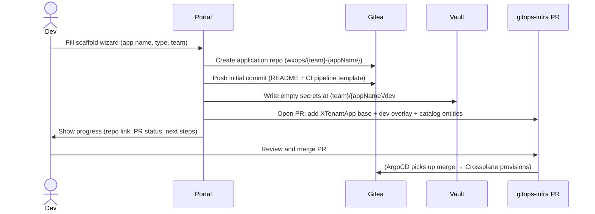

# Golden-Path Scaffolding

The Scaffold wizard creates everything a new service needs in one flow —
no platform ticket, no YAML hand-editing.


## What Gets Created



After the PR is merged:
- ArgoCD syncs the new overlay
- Crossplane creates the `XTenantApp` and `XTenantDatabase` CRs
- The app is alive in the `dev` environment


## Scaffold Wizard Steps

| Step | Fields | Notes |
|---|---|---|
| 1 — App details | App name, description, team | App name is slugified to lowercase-hyphen |
| 2 — Template | Template selector | Shows templates from `scaffold-templates` repo |
| 3 — Features | Database, external secrets, ingress | Feature toggles |
| 4 — Preview | YAML preview | Live render of all generated manifests |
| 5 — Create | Confirm | Runs the creation flow |

Scaffold wizard is a **feature toggles + extensions** wizard. Fields like DB
name, tier, cluster assignment, ingress host, and resource limits go into
the separate Promote overlay wizard when advancing lifecycle stages.


## Generated Directory Structure

```
tenants-apps/{team}/{appName}/
├── base/
│   ├── kustomization.yaml          ← lists all base resources
│   ├── xtenant-app.yaml            ← identity, image, wiring (env-agnostic)
│   ├── xtenant-database.yaml       ← (if database enabled)
│   ├── external-secret-app.yaml    ← (if secrets enabled)
│   └── catalog-component.yaml      ← catalog entity
└── overlays/
    └── dev/
        ├── kustomization.yaml      ← references ../../base
        ├── image-transformer.yaml  ← teaches Kustomize where spec/parameters/image is
        └── patch-xtenant-app.yaml  ← env-specific: replicas, resources, ingress, secretsFrom

tenants/{team}/
└── {appName}-image-updater.yaml   ← ArgoCD Image Updater CR (NOT inside tenants-apps/)
```


## Why `image-transformer.yaml` Exists

Kustomize knows how to substitute images in standard `Deployment` / `StatefulSet`
specs. `XTenantApp` is a Crossplane XR — the image lives at `spec/parameters/image`.
The transformer file registers this non-standard path so `kustomize build` can
reach it:

```yaml
apiVersion: builtin
kind: ImageTagTransformer
metadata:
  name: image-tag-transformer
imageTag:
  name: my-app
  newTag: latest
fieldSpecs:
  - path: spec/parameters/image
    kind: XTenantApp
```


## Why `images:` Is NOT in the Overlay `kustomization.yaml`

ArgoCD Image Updater writes the `images:` section back after every CI build.
If you add a static `images:` block, the Image Updater's write sets it to
`latest` on every reconcile, overwriting your pin. Leave that section empty —
the Image Updater owns it.


## ArgoCD Image Updater CR

Location: `tenants/{team}/{appName}-image-updater.yaml` (not in `tenants-apps/`)

```yaml
apiVersion: image.argoproj.io/v1alpha1
kind: ImageUpdateAutomation
metadata:
  name: {team}-{appName}            # unique across teams in shared argocd namespace
  namespace: argocd
spec:
  sourceType: Kustomize
  applicationSelector:
    matchExpressions:
      - key: argocd.argoproj.io/app-name
        operator: In
        values:
          - {team}-{appName}-dev
          - {team}-{appName}-staging
          - {team}-{appName}-production
```

### Image tag conventions

| Branch | Tag format | How |
|---|---|---|
| develop | `dev-{YYYY-MM-DD_HH-MM-SS}-{sha7}` | CI build |
| staging merge | `vX.Y.Z-rcN` | crane re-tag |
| production release | `vX.Y.Z` | crane re-tag |


## Scaffold Templates

:::caution Outdated example on this page
The `template.yaml` example below describes an experimental `kind: Template` CRD design
that was **never implemented** and does not reflect how templates actually work, in this
version or any other. See
[Golden-Path Scaffolding](/docs/scaffolding/golden-path#scaffold-templates) in the current
docs for the real `template.yaml` shape.
:::

Templates live in the `scaffold-templates` Gitea repository. Each template
has a `template.yaml` at its root:

```yaml
apiVersion: wxops.cloud/v1alpha1
kind: Template
metadata:
  name: go-http-service
  description: "Go HTTP service with health checks and structured logging."
  tags:
    - go
    - http
spec:
  defaults:
    replicas: 1
    resources:
      requests: { cpu: "100m", memory: "128Mi" }
      limits: { cpu: "500m", memory: "512Mi" }
  recommends:
    - feature: database
      when: "data persistence required"
    - feature: external-secrets
      when: "third-party API keys needed"
```

Platform teams add templates by pushing a new directory to `scaffold-templates`.
The portal discovers them via Gitea API — no config change needed.
